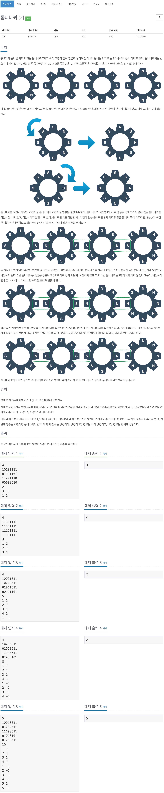
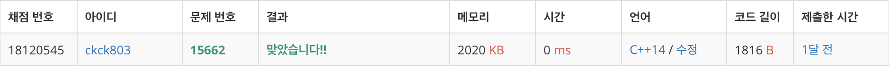

# 백준 15662 - 톱니바퀴(2)



## 채점 현황


## 전체 소스 코드
```cpp
#include <iostream>
using namespace std;

int T;
int wheel[1001][8];
int direction[1001];
int K;

int main(void) {
    cin >> T;

    for (int i = 1; i <= T; i++) {
        for (int j = 0; j < 8; j++) {
            scanf("%1d", &wheel[i][j]);
        }
    }

    cin >> K;
    while (K--) {
        int wheelNum;
        int dir;
        cin >> wheelNum >> dir;

        for (int i = 0; i <= 1000; i++) {
            direction[i] = 0;
        }

        direction[wheelNum] = dir;

        int start = wheelNum;
        int end = wheelNum;

        int startDir = dir;
        int endDir = dir;

        while (end + 1 <= T && wheel[end][2] != wheel[end + 1][6]) {
            end++;
            endDir *= -1;

            direction[end] = endDir;
        }

        while (start - 1 >= 1 && wheel[start - 1][2] != wheel[start][6]) {
            start--;
            startDir *= -1;

            direction[start] = startDir;
        }

        for (int i = start; i <= end; i++) {
            int tempDir = direction[i];
            int temp[8];

            if (tempDir == -1) {
                for (int j = 0; j < 8; j++) {
                    temp[j] = wheel[i][j];
                }

                for (int j = 0; j < 7; j++) {
                    wheel[i][j] = temp[j + 1];
                }
                wheel[i][7] = temp[0];

            } else {
                for (int j = 0; j < 8; j++) {
                    temp[j] = wheel[i][j];
                }

                wheel[i][0] = temp[7];
                for (int j = 1; j < 8; j++) {
                    wheel[i][j] = temp[j - 1];
                }
            }
        }
    }

    int s_num = 0;
    for (int i = 1; i <= T; i++) {
        if (wheel[i][0] == 1) {
            s_num++;
        }
    }

    cout << s_num << '\n';
    return 0;
}
```