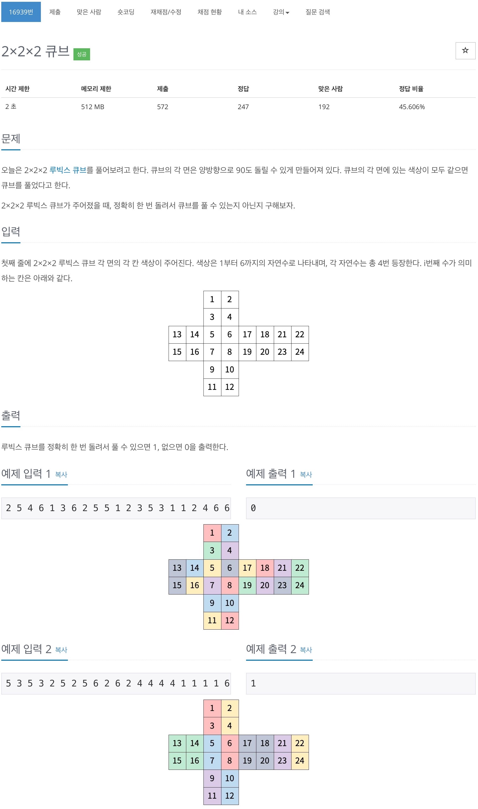

# 백준 16939 - 2×2×2 큐브


## 문제 풀이
큐빙 문제를 풀었다면 쉽게 풀 수 있는거 같다. 배열의 이동 연산이 관건인 문제이다.

## 전체 소스 코드
```cpp
#include <bits/stdc++.h>
using namespace std;

int cube[25];
int blocks[6][8] = {
    {1, 3, 5, 7, 9, 11, 24, 22},
    {2, 4, 6, 8, 10, 12, 23, 21},
    {13, 14, 5, 6, 17, 18, 21, 22},
    {15, 16, 7, 8, 19, 20, 23, 24},
    {3, 4, 17, 19, 10, 9, 16, 14},
    {1, 2, 18, 20, 12, 11, 15, 13},
};
bool isPass = false;

void moveCube(int dir) {
    int temp[8];
    for (int i = 0; i < 8; i++) {
        int index = blocks[dir][(i + 2) % 8];

        temp[i] = cube[index];
    }

    for (int i = 0; i < 8; i++) {
        int index = blocks[dir][i];

        cube[index] = temp[i];
    }
}

bool isAllSame() {
    for (int i = 0; i < 6; i++) {
        int start = (i * 4) + 1;

        int color = cube[start];
        for (int j = start; j < start + 4; j++) {
            if (color != cube[j]) {
                return false;
            }
        }
    }
    return true;
}

int move() {
    // 정면 왼쪽 위
    for (int i = 0; i < 6; i++) {
        moveCube(i);
        if (isAllSame()) {
            return 1;
        }
        for (int j = 0; j < 2; j++) {
            moveCube(i);
        }
        if (isAllSame()) {
            return 1;
        }
        moveCube(i);
    }
    return 0;
}

int main(void) {
    int n = 24;

    for (int i = 1; i <= n; i++) {
        cin >> cube[i];
    }

    cout << move() << '\n';
}
```