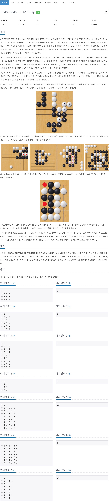
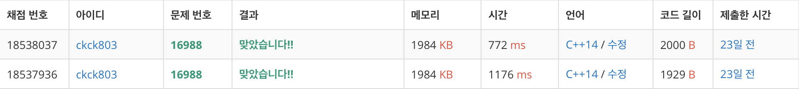

# 백준 16988 - Baaaaaaaaaduk2 (Easy)



## 채점 현황


## 전체 소스 코드
```cpp
#include <iostream>
#include <queue>
#include <vector>
using namespace std;

int n, m;
int board[22][22];
int maxNum;
int dx[4] = {1, -1, 0, 0};
int dy[4] = {0, 0, 1, -1};

int bfs(int y, int x, vector<vector<bool>>& check) {
    queue<pair<int, int>> q;
    q.push({y, x});
    check[y][x] = true;

    int num = 1;
    bool isBreak = false;
    while (!q.empty()) {
        int cntY = q.front().first;
        int cntX = q.front().second;
        q.pop();

        for (int i = 0; i < 4; i++) {
            int ny = cntY + dy[i];
            int nx = cntX + dx[i];

            if (0 <= ny && ny < n && 0 <= nx && nx < m) {
                if (board[ny][nx] == 2 && check[ny][nx] == false) {
                    check[ny][nx] = true;
                    num++;
                    q.push({ny, nx});
                }

                if (board[ny][nx] == 0) {
                    isBreak = true;
                }
            }
        }
    }

    if (!isBreak) {
        return num;
    }
    return 0;
}

void searchBoard() {
    vector<vector<bool>> check(n, vector<bool>(m, false));
    int totalNum = 0;
    for (int i = 0; i < n; i++) {
        for (int j = 0; j < m; j++) {
            if (!check[i][j] && board[i][j] == 2) {
                totalNum += bfs(i, j, check);
            }
        }
    }

    if (maxNum < totalNum) {
        maxNum = totalNum;
    }
}

void putStone(int num) {
    if (num == 0) {
        searchBoard();
        return;
    }

    for (int i = 0; i < n; i++) {
        for (int j = 0; j < m; j++) {
            if (board[i][j] == 0) {
                board[i][j] = 1;
                putStone(num - 1);
                board[i][j] = 0;
            }
        }
    }
}

int main(void) {
    cin.tie(0);
    cout.tie(0);
    ios_base::sync_with_stdio(false);
    cin >> n >> m;
    for (int i = 0; i < n; i++) {
        for (int j = 0; j < m; j++) {
            cin >> board[i][j];
        }
    }

    putStone(2);

    cout << maxNum << '\n';
    return 0;
}
```