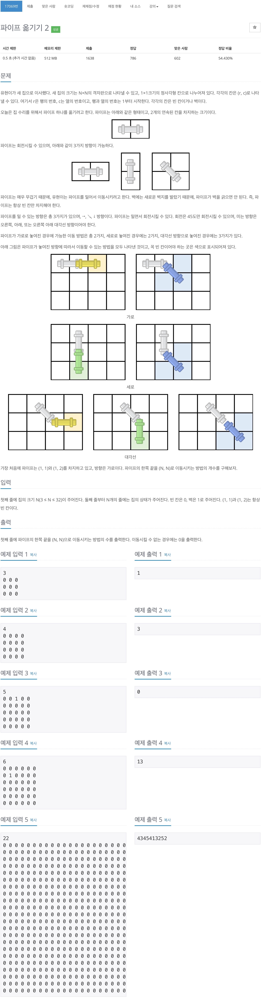
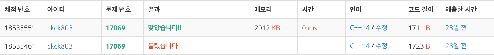

# 백준 17069 - 파이프 옮기기 2



## 채점 현황


## 전체 소스 코드
```cpp
#include <iostream>
#include <vector>
using namespace std;

int n;
long long totalNum;
int map[33][33];
long long dp[3][33][33];

struct pipe {
    int headY;
    int headX;

    // 0 : 가로, 1 : 세로, 2 : 대각선
    int state;
};

int main(void) {
    cin >> n;
    for (int i = 0; i < n; i++) {
        for (int j = 0; j < n; j++) {
            cin >> map[i][j];
        }
    }

    dp[0][0][1] = 1;
    for (int i = 0; i < n; i++) {
        for (int j = 0; j < n; j++) {
            if (dp[0][i][j] != 0) {
                if (j + 1 < n && map[i][j + 1] != 1)
                    dp[0][i][j + 1] += dp[0][i][j];
                if (j + 1 < n && i + 1 < n && map[i][j + 1] != 1 && map[i + 1][j] != 1 && map[i + 1][j + 1] != 1)
                    dp[2][i + 1][j + 1] += dp[0][i][j];
            }
            if (dp[1][i][j] != 0) {
                if (i + 1 < n && map[i + 1][j] != 1)
                    dp[1][i + 1][j] += dp[1][i][j];
                if (j + 1 < n && i + 1 < n && map[i][j + 1] != 1 && map[i + 1][j] != 1 && map[i + 1][j + 1] != 1)
                    dp[2][i + 1][j + 1] += dp[1][i][j];
            }
            // 대각선일 때
            if (dp[2][i][j] != 0) {
                if (j + 1 < n && map[i][j + 1] != 1)
                    dp[0][i][j + 1] += dp[2][i][j];
                if (i + 1 < n && map[i + 1][j] != 1)
                    dp[1][i + 1][j] += dp[2][i][j];
                if (j + 1 < n && i + 1 < n && map[i][j + 1] != 1 && map[i + 1][j] != 1 && map[i + 1][j + 1] != 1)
                    dp[2][i + 1][j + 1] += dp[2][i][j];
            }
        }
    }

    cout << dp[0][n - 1][n - 1] + dp[1][n - 1][n - 1] + dp[2][n - 1][n - 1] << '\n';
    return 0;
}
```