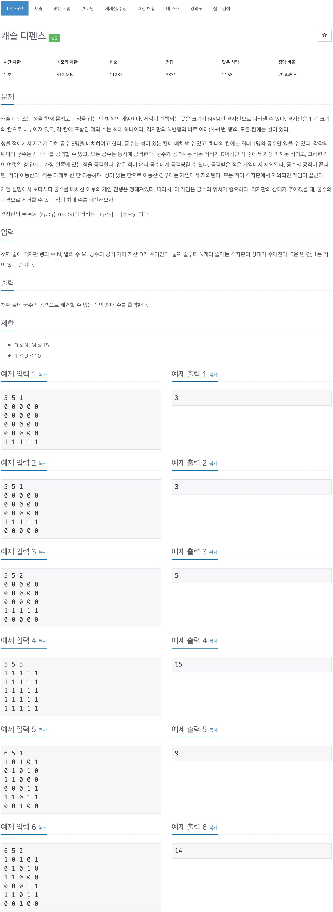
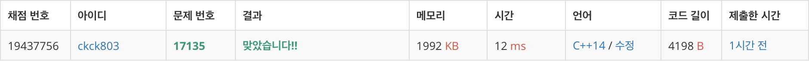

# 백준 17135 - 캐슬 디펜스



## 채점 현황



## 전체 소스 코드
```cpp
#include <bits/stdc++.h>
using namespace std;

#define INF 987654321

// 성을 적에게서 지키기 위해 궁수 3명을 배치하려고 한다.
// 궁수는 성이 있는 칸에 배치할 수 있고, 하나의 칸에는 최대 1명의 궁수만 있을 수 있다
// 각각의 턴마다 궁수는 적 하나를 공격할 수 있고, 모든 궁수는 동시에 공격한다.
// 궁수가 공격하는 적은 거리가 D이하인 적 중에서 가장 가까운 적이고, 그러한 적이 여럿일 경우에는 가장 왼쪽에 있는 적을 공격한다
// 궁수의 공격이 끝나면, 적이 이동한다. 적은 아래로 한 칸 이동하며, 성이 있는 칸으로 이동한 경우에는 게임에서 제외된다.
// 모든 적이 격자판에서 제외되면 게임이 끝난다.

int board[20][20];
int origin_board[20][20];
int N, M, D;
vector<vector<int>> combinations;
vector<int> v;
int maxValue;

void nCr(int index, int r) {
    if (r == 3) {
        vector<int> temp(3);
        for (int i = 0; i < 3; i++) {
            temp[i] = v[i];
        }
        combinations.push_back(temp);
        return;
    }

    for (int i = index; i < M; i++) {
        v[r] = i;
        nCr(i + 1, r + 1);
        v[r] = 0;
    }
}

int calDist(int archer_y, int archer_x, int y, int x) {
    return abs(archer_y - y) + abs(archer_x - x);
}

void Drop() {
    int temp[20][20];
    for (int i = 0; i < N; i++) {
        for (int j = 0; j < M; j++) {
            temp[i][j] = board[i][j];
            board[i][j] = 0;
        }
    }

    for (int i = 0; i < N; i++) {
        for (int j = 0; j < M; j++) {
            if (i - 1 >= 0) {
                board[i][j] = temp[i - 1][j];
            }
        }
    }
}

int main(void) {
    cin >> N >> M >> D;

    v = vector<int>(M);
    for (int i = 0; i < N; i++) {
        for (int j = 0; j < M; j++) {
            cin >> board[i][j];
        }
    }
    nCr(0, 0);
    for (int i = 0; i < N; i++) {
        for (int j = 0; j < M; j++) {
            origin_board[i][j] = board[i][j];
        }
    }

    for (auto &v : combinations) {
        int totalNum = 0;
        int num = N;
        while (num--) {
            queue<pair<int, int>> q;
            // 궁수 숫자 만큼 돈다.
            for (int i = 0; i < v.size(); i++) {
                int archer_y = N;
                int archer_x = v[i];

                int minDist = INF;
                int minY = N, minX = M;

                // 마지막 부터 탐색
                for (int j = N - 1; j >= 0; j--) {
                    // 왼쪽 부터 탐색
                    for (int k = 0; k < M; k++) {
                        if (board[j][k] == 1) {
                            int dist = calDist(archer_y, archer_x, j, k);

                            if (minDist > dist) {
                                minDist = dist;
                                minX = k;
                                minY = j;
                            } else if (minDist == dist) {
                                if (minX > k) {
                                    minX = k;
                                    minY = j;
                                }
                            }
                        }
                    }
                }

                if (minDist <= D) {
                    q.push({minY, minX});
                }
            }

            while (!q.empty()) {
                int cntY = q.front().first;
                int cntX = q.front().second;
                q.pop();

                if (board[cntY][cntX]) {
                    totalNum++;
                    board[cntY][cntX] = 0;
                }
            }

            Drop();
        }
        maxValue = max(maxValue, totalNum);

        for (int i = 0; i < N; i++) {
            for (int j = 0; j < M; j++) {
                board[i][j] = origin_board[i][j];
            }
        }
    }

    cout << maxValue << '\n';
    return 0;
}
```