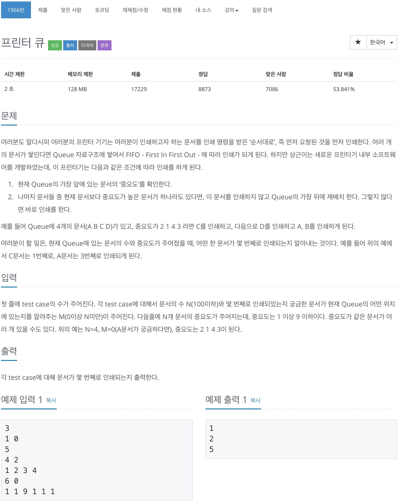
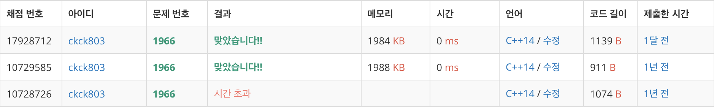

# 백준 1966 - 프린터 큐



## 채점 현황


## 전체 소스 코드
```cpp
#include <iostream>
#include <queue>
using namespace std;

int testcase;
int n, m;
vector<int> important;
int maxNum;
int totalNum;

int main(void) {
    cin >> testcase;

    while (testcase--) {
        cin >> n >> m;
        queue<pair<int, int>> q;
        totalNum = 0;
        maxNum = 0;
        important = vector<int>(10);

        for (int i = 0; i < n; i++) {
            int number;
            cin >> number;

            q.push({number, i});
            important[number] += 1;

            if (maxNum < number) {
                maxNum = number;
            }
        }

        while (!q.empty()) {
            int cntPriority = q.front().first;
            int cntIndex = q.front().second;
            q.pop();

            if (cntPriority < maxNum) {
                q.push({cntPriority, cntIndex});
                continue;
            }

            totalNum++;

            if (cntIndex == m) {
                cout << totalNum << '\n';
                break;
            }

            important[maxNum] -= 1;
            while (important[maxNum] == 0) {
                maxNum--;
            }
        }
    }
}
```