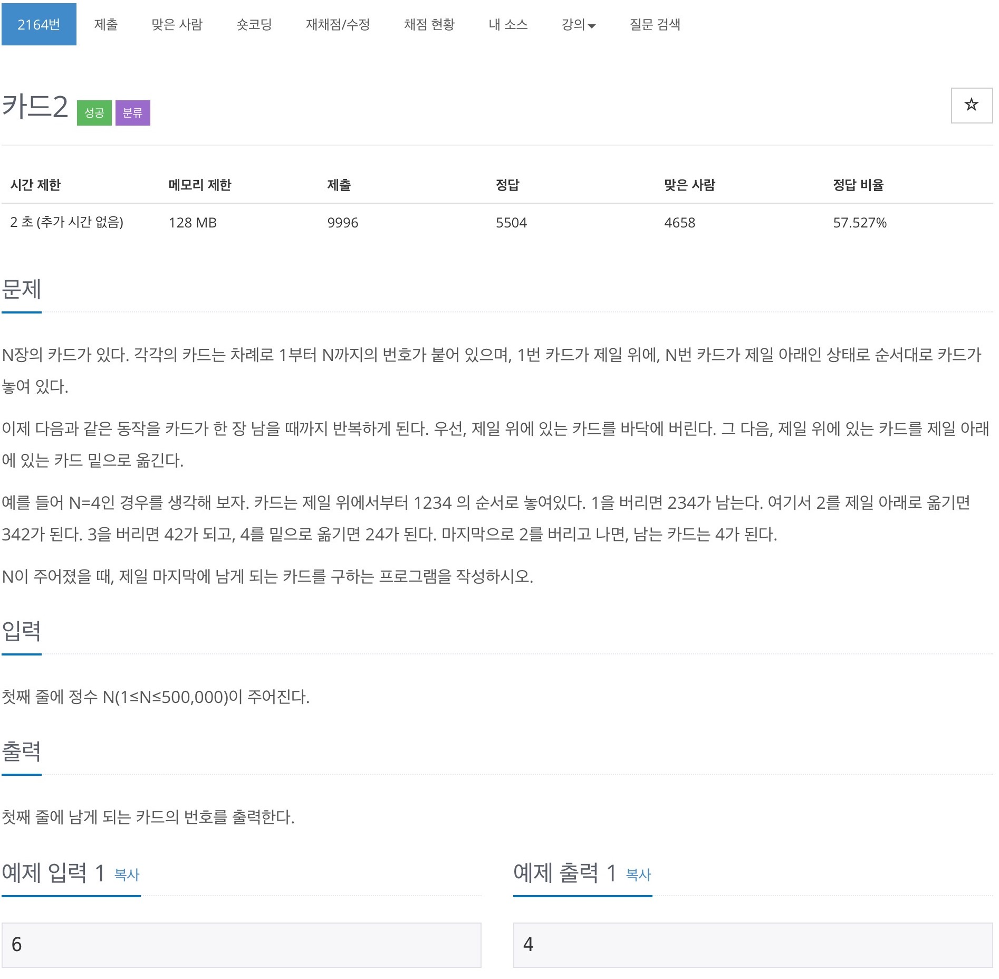
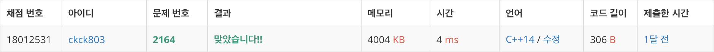

# 백준 2164 - 카드 2



## 채점 현황 



## 전체 소스 코드
```cpp
#include <iostream>
#include <queue>
using namespace std;

int n;
queue<int> q;

int main(void) {
    cin >> n;

    for (int i = 0; i < n; i++) {
        q.push(i + 1);
    }

    while (q.size() != 1) {
        q.pop();

        q.push(q.front());
        q.pop();
    }

    cout << q.front() << endl;
}
```