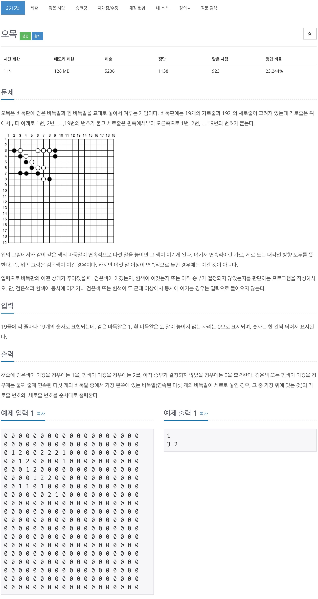
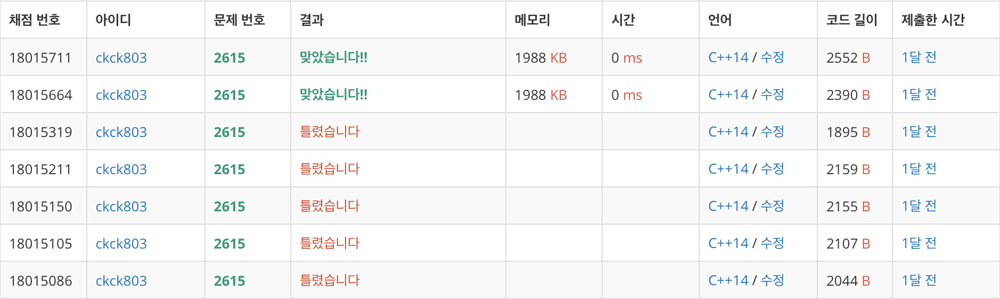

# 백준 2615 - 오목



## 채점 현황


## 전체 소스 코드
```cpp
#include <iostream>
using namespace std;

bool isFinish = false;
int board[20][20];
bool row_check[20][20];
bool col_check[20][20];
bool digonal_Down_check[20][20];
bool digonal_Up_check[20][20];

void omoc(int y, int x, int color) {
    int num = 0;
    int cntY = y;
    int cntX = x;
    // 오른쪽으로 이동
    while (board[cntY][cntX] == color && row_check[cntY][cntX] == false) {
        num++;
        row_check[cntY][cntX] = true;
        cntX += 1;

        if (1 > cntX || cntX > 19) {
            break;
        }
    }
    if (num == 5) {
        isFinish = true;
        cout << color << '\n';
        cout << y << " " << x << '\n';
        return;
    }

    num = 0;
    cntY = y;
    cntX = x;
    // 아래로 이동
    while (board[cntY][cntX] == color && col_check[cntY][cntX] == false) {
        num++;
        col_check[cntY][cntX] = true;
        cntY += 1;

        if (1 > cntY || cntY > 19) {
            break;
        }
    }
    if (num == 5) {
        isFinish = true;
        cout << color << '\n';
        cout << y << " " << x << '\n';
        return;
    }

    num = 0;
    cntY = y;
    cntX = x;
    // 대각선 아래 이동
    while (board[cntY][cntX] == color && digonal_Down_check[cntY][cntX] == false) {
        num++;
        digonal_Down_check[cntY][cntX] = true;
        cntY += 1;
        cntX += 1;

        if (1 > cntY || cntY > 19 || 1 > cntX || cntX > 19) {
            break;
        }
    }

    if (num == 5) {
        isFinish = true;
        cout << color << '\n';
        cout << y << " " << x << '\n';
        return;
    }

    num = 0;
    cntY = y;
    cntX = x;
    //대각선 위로 이동
    while (board[cntY][cntX] == color && digonal_Up_check[cntY][cntX] == false) {
        num++;
        digonal_Up_check[cntY][cntX] = true;
        cntY -= 1;
        cntX += 1;

        if (1 > cntY || cntY > 19 || 1 > cntX || cntX > 19) {
            break;
        }
    }

    if (num == 5) {
        isFinish = true;
        cout << color << '\n';
        cout << y << " " << x << '\n';
        return;
    }
}

int main(void) {
    for (int i = 1; i < 20; i++) {
        for (int j = 1; j < 20; j++) {
            cin >> board[i][j];
        }
    }

    for (int j = 1; j < 20; j++) {
        for (int i = 1; i < 20; i++) {
            if (board[i][j] != 0 && isFinish == false) {
                omoc(i, j, board[i][j]);
                // cout << i << " " << j << endl;
            }
        }
    }

    if (isFinish == false) {
        cout << 0 << '\n';
    }

    return 0;
}
```