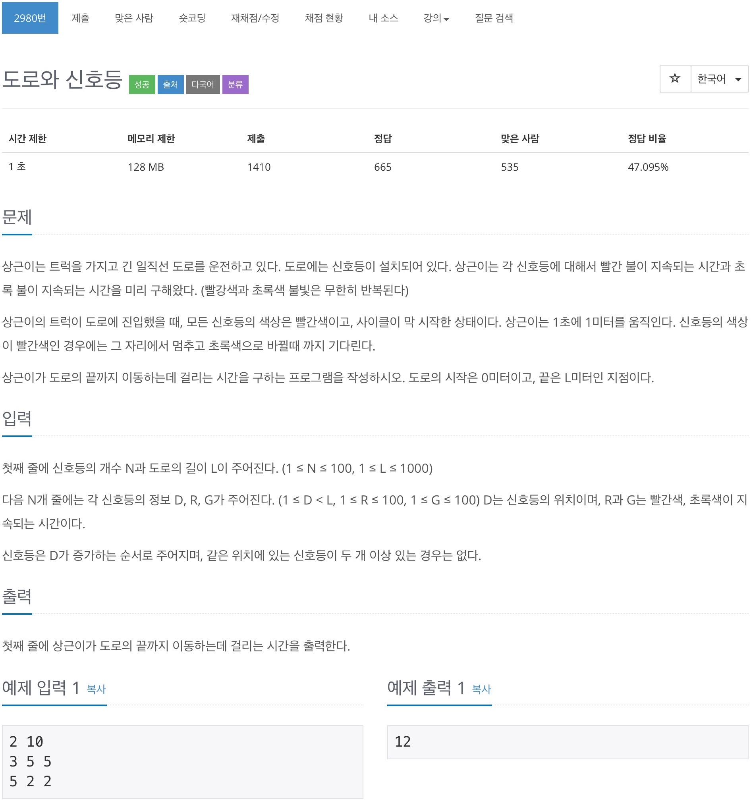
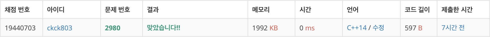

# 백준 2980 - 도로와 신호등



## 채점 현황



## 전체 소스 코드
```cpp
#include <bits/stdc++.h>
using namespace std;

int N, L;
int Time;
pair<int, int> load[1010];

int main(void) {
    cin >> N >> L;

    for (int i = 0; i < N; i++) {
        int D, R, G;
        cin >> D >> R >> G;
        load[D] = {R, G};
    }

    int cnt = 0;
    while (cnt < L) {
        Time++;
        cnt++;

        if (load[cnt].first == 0) {
            continue;
        }
        int totalTime = load[cnt].first + load[cnt].second;
        int remainder = Time % totalTime;

        if (remainder < load[cnt].first)
            cnt--;
    }
    cout << Time << '\n';
    return 0;
}
```