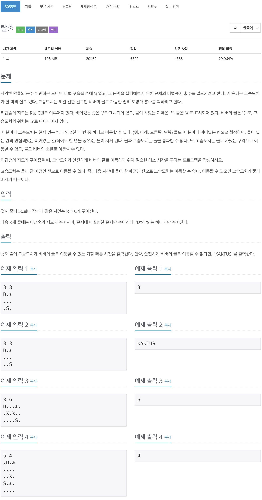
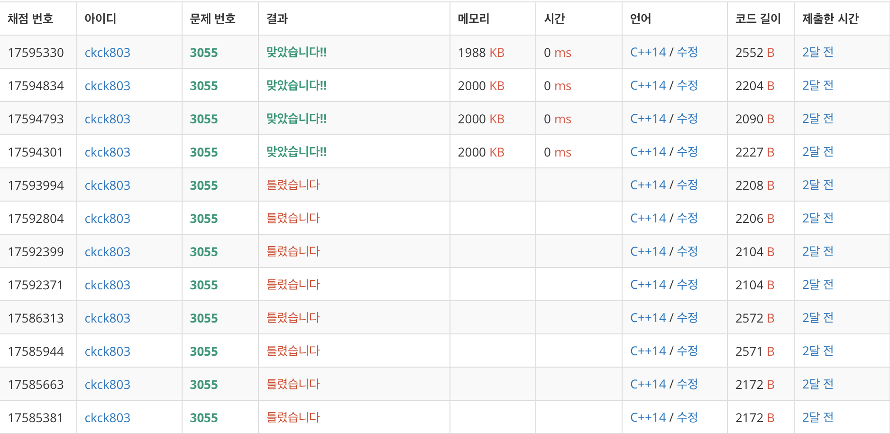

# 백준 3055 - 탈출



## 채점 현황


## 전체 소스 코드
```cpp
#include <iostream>
#include <queue>
using namespace std;

int R, C;
char map[51][51];
int waterMap[51][51];
bool check[51][51];
int dx[4] = {1, 0, -1, 0};
int dy[4] = {0, 1, 0, -1};
queue<pair<int, int>> point;
queue<pair<int, int>> water;

void flood() {
    while (!water.empty()) {
        int y = water.front().first;
        int x = water.front().second;
        water.pop();

        for (int i = 0; i < 4; i++) {
            int ny = y + dy[i];
            int nx = x + dx[i];

            if (0 <= ny && ny < R && 0 <= nx && nx < C) {
                if (map[ny][nx] == '.') {
                    if (waterMap[ny][nx] > waterMap[y][x] + 1) {
                        waterMap[ny][nx] = waterMap[y][x] + 1;
                        water.push({ny, nx});
                    }
                }
            }
        }
    }
}

void findD() {
    int level = 0;
    int point_size;
    while (!point.empty()) {
        level++;
        point_size = point.size();

        while (point_size--) {
            int y = point.front().first;
            int x = point.front().second;
            point.pop();

            if (map[y][x] == 'D') {
                cout << level - 1 << '\n';
                return;
            }

            for (int i = 0; i < 4; i++) {
                int ny = y + dy[i];
                int nx = x + dx[i];

                if (0 <= ny && ny < R && 0 <= nx && nx < C) {
                    if (map[ny][nx] != 'X' && check[ny][nx] == false && level < waterMap[ny][nx]) {
                        check[ny][nx] = true;
                        point.push({ny, nx});
                    }
                }
            }
        }
    }

    cout << "KAKTUS" << '\n';
    return;
}

int main(void) {
    cin >> R >> C;

    for (int i = 0; i < R; i++) {
        for (int j = 0; j < C; j++) {
            cin >> map[i][j];
            waterMap[i][j] = 10000;

            if (map[i][j] == 'S') {
                point.push({i, j});
                check[i][j] = true;
            }

            if (map[i][j] == '*') {
                water.push({i, j});
                waterMap[i][j] = 0;
            }
        }
    }

    flood();
    findD();

    return 0;
}
```