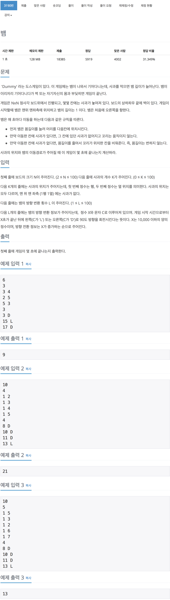

# 백준 3190 - 뱀

[3190 - 뱀](https://www.acmicpc.net/problem/3190)



```cpp
#include <iostream>
#include <vector>
#include <queue>
using namespace std;

int arr[110][110];
bool check[110][110];

queue<pair<int, int>> snake;
queue<pair<int, char>> d;

// 보드의 크기 N, 사과의 개수 K
int N, K;
// 방향 횟수 L
int L;

int count;

// 움직이는 방향
int dir = 0;
int dx[4] = {1, 0, -1, 0};
int dy[4] = {0, 1, 0, -1};

void direction(char c)
{
    if (c == 'D')
    {
        dir = (dir + 1) % 4;
    }
    else
    {
        dir = (dir + 3) % 4;
    }
}

int main(void)
{
    scanf("%d", &N);
    scanf("%d", &K);

    // 사과의 좌표
    for (int i = 0; i < K; i++)
    {
        int y, x;
        scanf("%d %d", &y, &x);
        arr[y][x] = 1;

        // cout << y << " " << x << endl;
    }
    // 1행 1열에는 사과가 없다.
    arr[1][1] = 0;

    // 뱀의 방향 전환 정보
    scanf("%d", &L);
    for (int i = 0; i < L; i++)
    {
        int a;
        char c;
        scanf("%d %c", &a, &c);
        d.push(make_pair(a, c));

        // cout << a << " " << c << endl;
    }

    int cnt_x = 1;
    int cnt_y = 1;
    snake.push(make_pair(cnt_y, cnt_x));

    int count = 10001;
    char next_d;
    // 방향 전환 자체가 안들어올 수 있으므로 유효성 검사를 해준다.
    if (!d.empty())
    {
        pair<int, char> temp = d.front();
        d.pop();
        count = temp.first;
        next_d = temp.second;
    }

    // 뱀이 움직이는 부분
    int i = 0;
    while (++i)
    {
        cnt_x = cnt_x + dx[dir];
        cnt_y = cnt_y + dy[dir];

        // cout << move_y << " " << move_x << endl;

        // 벽에 부딪히는지 확인한다.
        if (1 > cnt_x || cnt_x > N || 1 > cnt_y || cnt_y > N || check[cnt_y][cnt_x] == true)
        {
            break;
        }

        snake.push(make_pair(cnt_y, cnt_x));
        check[cnt_y][cnt_x] = true;

        // 사과가 놓여 있을 경우
        if (arr[cnt_y][cnt_x] == 1)
        {
            arr[cnt_y][cnt_x] = 0;
        }
        // 사과가 놓여 있지 않는 경우
        else
        {
            pair<int, int> tail = snake.front();
            snake.pop();

            check[tail.first][tail.second] = false;
        }

        // count초가 끝난 후에는 방향을 바꾸어준다.
        if (i == count)
        {
            // cout << i << " " << count << endl;
            direction(next_d);
            if (!d.empty())
            {
                pair<int, char> temp = d.front();
                d.pop();
                count = temp.first;
                next_d = temp.second;
            }
        }
    }

    // printf("%d\n", snake.size());
    printf("%d\n", i);
    return 0;
}
```
