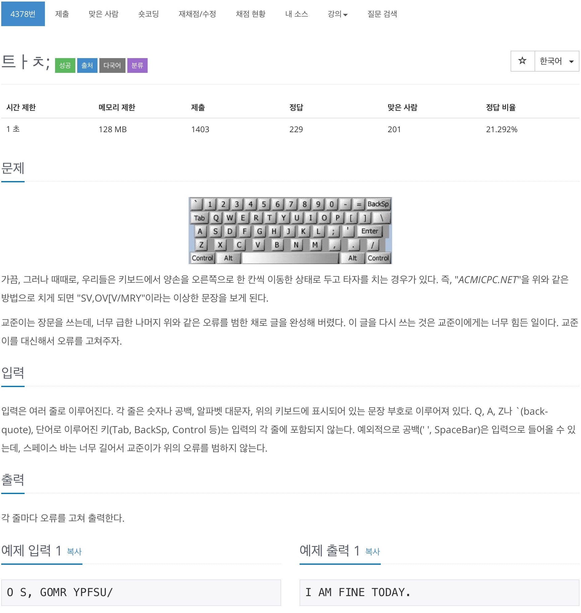
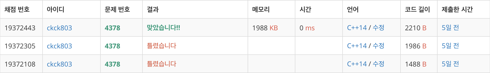

# 백준 4378 - 트ㅏㅊ; 



## 채점 현황



## 전체 소스 코드
```cpp
#include <bits/stdc++.h>
using namespace std;

char keyboardNumber[12] = {'1', '2', '3', '4', '5', '6', '7', '8', '9', '0', '-', '='};
char keyboard1[12] = {'W', 'E', 'R', 'T', 'Y', 'U', 'I', 'O', 'P', '[', ']', '\\'};
char keyboard2[10] = {'S', 'D', 'F', 'G', 'H', 'J', 'K', 'L', ';', '\''};
char keyboard3[9] = {'X', 'C', 'V', 'B', 'N', 'M', ',', '.', '/'};

char newKeyboardNumber[13] = {'`', '1', '2', '3', '4', '5', '6', '7', '8', '9', '0', '-', '='};
char newKeyboard1[13] = {'Q', 'W', 'E', 'R', 'T', 'Y', 'U', 'I', 'O', 'P', '[', ']', '\\'};
char newKeyboard2[11] = {'A', 'S', 'D', 'F', 'G', 'H', 'J', 'K', 'L', ';', '\''};
char newKeyboard3[10] = {'Z', 'X', 'C', 'V', 'B', 'N', 'M', ',', '.', '/'};

int main(void) {
    string s;
    while (getline(cin, s, '\n')) {
        for (int i = 0; i < s.size(); i++) {
            if (s[i] == ' ') {
                cout << " ";
                continue;
            }

            int idx = -1;

            for (int j = 0; j < 12; j++) {
                if (s[i] == keyboardNumber[j]) {
                    idx = j;
                    break;
                }
            }

            if (idx == -1) {
                for (int j = 0; j < 12; j++) {
                    if (s[i] == keyboard1[j]) {
                        idx = j;
                        break;
                    }
                }
            } else {
                cout << newKeyboardNumber[idx];
                continue;
            }

            if (idx == -1) {
                for (int j = 0; j < 10; j++) {
                    if (s[i] == keyboard2[j]) {
                        idx = j;
                        break;
                    }
                }
            } else {
                cout << newKeyboard1[idx];
                continue;
            }

            if (idx == -1) {
                for (int j = 0; j < 9; j++) {
                    if (s[i] == keyboard3[j]) {
                        idx = j;
                        break;
                    }
                }
            } else {
                cout << newKeyboard2[idx];
                continue;
            }

            cout << newKeyboard3[idx];
        }
        cout << '\n';
    }
}
```