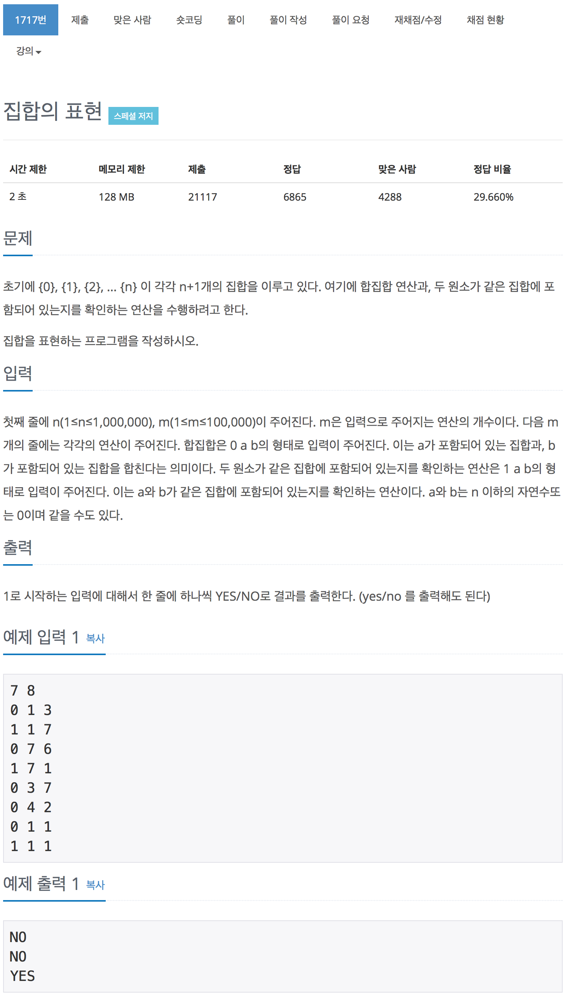

# 백준 1717 - 집합의 표현

[1717 - 집합의 표현](https://www.acmicpc.net/problem/1717)



전형적인 유니온 파인드 문제이다.
같은 집합인지 확인하기 위해서는 `find`함수를 이용하여 두 원소가 같은 부모를 갖는지 확인하고,
합집합 연산을 하기 위해서 먼저 `find`함수를 이용하여 두 원소가 같은 부모를 갖는지 확인하고,
서로 다른 집합에 속하면 두 집합을 `merge`함수를 이용하여 합쳐주면 된다.

### 집합 초기화

```cpp
for (int i = 0; i < n + 1; i++)
    parent[i] = i;
```

`parent[i]`는 원소 `i`가 속한 집합 번호가 들어가 있다. 처음에는 자기자신만을 원소로 가지므로, `parent[i]`를 원소 `i`로 초기화 시켜준다.

## find

```cpp
int find(int a)
{
    if (parent[a] == a)
        return a;
    else
    {
        return parent[a] = find(parent[a]);
    }
}
```

`find`연산을 통해 원소 `a`가 속한 집합의 영역을 찾는다. `parent[a]`에는 원소 `a`가 속한 집합이 저장되어 있다. 때문에

1. 원소 `a`와 `parent[a]`가 같은 값을 갖는지 확인을 한다.
2. 같은 값을 갖지 않는다고 하면 재귀적으로 올라가 원소 `a`가 속한 집합의 영역을 찾는다.
3. 속한 영역을 찾게 되면 `parent[a]`에 속한 집합의 영역을 저장한다.
4. 마지막으로 그 값(속한영역)을 반환하면 된다.

## merge

```cpp
void merge(int a, int b)
{
    int set_a = find(a);
    int set_b = find(b);

    if (set_a == set_b)
        return;

    parent[set_b] = set_a;
}
```

`merge`연산은 두 집합을 합치는 연산이다. 먼저 `find`함수를 이용하여 각각의 원소들이 속한 집합을 알아낸 후 같은 집합에 속한 것인지 확인한다. 만약 같은 집합에 속한 것이면 `merge`를 할 필요가 없으므로 반환하고 다른 집합에 속하면 하나의 집합을 다른 집합에 포함되게 한다.

### 전체 소스 코드

```cpp
#include <iostream>
using namespace std;

#define MAX_VALUE 1000001
int n, m;
int parent[MAX_VALUE];

int find(int a)
{
    if (parent[a] == a)
        return a;
    else
    {
        return parent[a] = find(parent[a]);
    }
}

void merge(int a, int b)
{
    int set_a = find(a);
    int set_b = find(b);

    if (set_a == set_b)
        return;

    parent[set_b] = set_a;
}

int main(void)
{
    scanf("%d %d", &n, &m);

    for (int i = 0; i < n + 1; i++)
        parent[i] = i;

    while (m--)
    {
        int o, a, b;
        scanf("%d %d %d", &o, &a, &b);

        if (o == 0)
            merge(a, b);
        else if (o == 1)
        {
            int set_a = find(a);
            int set_b = find(b);

            if (set_a == set_b)
                printf("yes\n");
            else
                printf("no\n");
        }
    }

    return 0;
}
```
