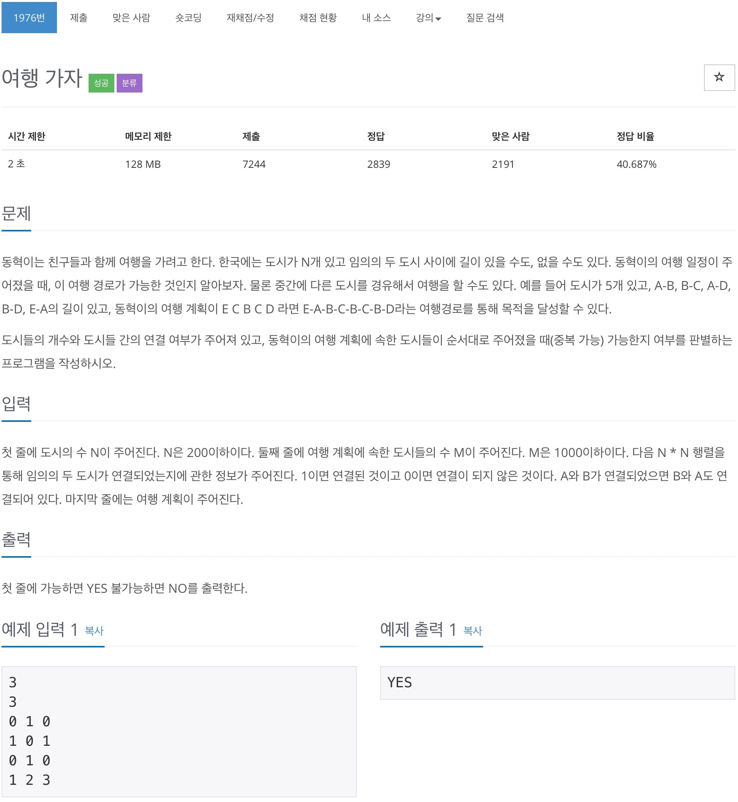

# 백준 1976 - 여행가자

https://www.acmicpc.net/problem/1976



## 전체 소스 코드
```cpp
#include <iostream>
#include <vector>
using namespace std;

#define MAX_VALUE 202

int n, m;
int city[MAX_VALUE][MAX_VALUE];

int parent[MAX_VALUE];

int find(int a)
{
    if (parent[a] == a)
        return a;
    return parent[a] = find(parent[a]);
}

void merge(int a, int b)
{
    int set_a = find(a);
    int set_b = find(b);

    if (set_a == set_b)
        return;
    parent[set_b] = set_a;
}

int main(void)
{
    ios_base::sync_with_stdio(false);
    cin.tie(0);
    cin >> n >> m;

    for (int i = 1; i <= n; i++)
        parent[i] = i;

    for (int i = 1; i <= n; i++)
        for (int j = 1; j <= n; j++)
        {
            int temp;
            cin >> temp;

            if (temp == 1)
                merge(i, j);
        }

    vector<int> v;
    for (int i = 0; i < m; i++)
    {
        int temp;
        cin >> temp;
        v.push_back(temp);
    }

    for (int i = 0; i < m - 1; i++)
    {
        if (find(v[i]) == find(v[i + 1]))
            continue;
        else
        {
            cout << "NO" << '\n';
            return 0;
        }
    }
    cout << "YES" << '\n';
    return 0;
}
```
