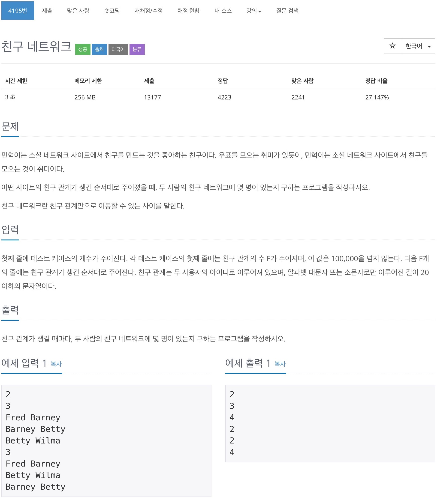

# 백준 4195 - 친구 네트워크



## 전체 소스 코드
```cpp
#include <iostream>
#include <map>
#include <vector>
using namespace std;

int parent[100001];
int arr[100001];

int find(int x) {
    if (x == parent[x]) {
        return x;
    } else {
        return parent[x] = find(parent[x]);
    }
}

void merge(int a, int b) {
    int setA = find(a);
    int setB = find(b);

    if (setA != setB) {
        parent[setA] = setB;
        arr[setB] += arr[setA];
        arr[setA] = 1;
    }

    cout << arr[setB] << '\n';
}

void init(int n) {
    for (int i = 0; i <= n; i++) {
        parent[i] = i;
        arr[i] = 1;
    }
}

int main(void) {
    int T;
    cin.tie(0);
    cout.tie(0);
    ios_base::sync_with_stdio(false);
    cin >> T;
    while (T--) {
        int F;
        map<string, int> friends;
        cin >> F;

        init(F);

        int friendNum = 0;
        for (int i = 0; i < F; i++) {
            string name1, name2;
            cin >> name1 >> name2;

            int index1;
            if (friends.find(name1) != friends.end()) {
                index1 = friends[name1];
            } else {
                index1 = friendNum;
                friends[name1] = friendNum++;
            }

            int index2;
            if (friends.find(name2) != friends.end()) {
                index2 = friends[name2];
            } else {
                index2 = friendNum;
                friends[name2] = friendNum++;
            }

            merge(index1, index2);
        }
    }

    return 0;
}
```