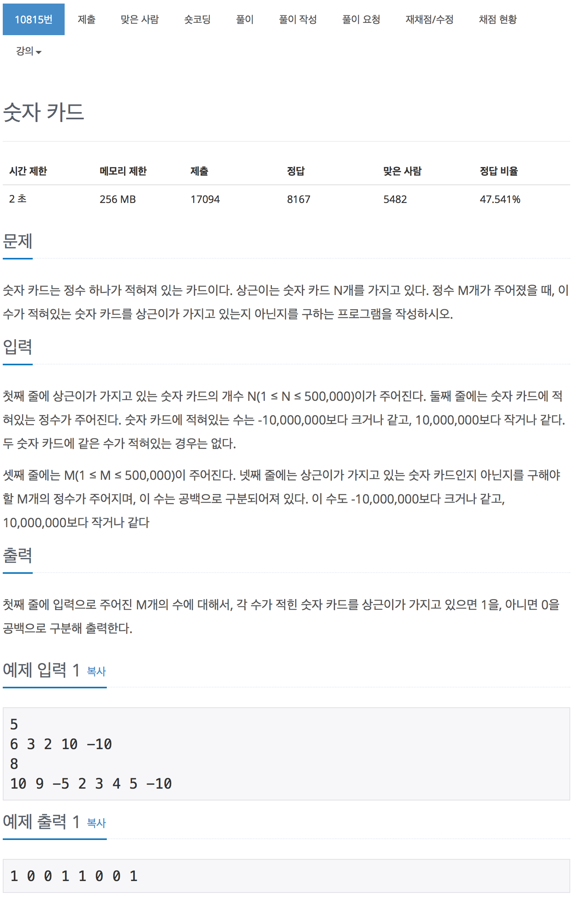

# 백준 10815 - 숫자 카드

[10815 - 숫자 카드](https://www.acmicpc.net/problem/10815)



<br>

### 이진탐색 부분

```cpp
void bisearch(int start, int end, int n)
{
    int mid = (start + end) / 2;

    if (start > end)
    {
        cout << 0 << " ";
        return;
    }

    if (n == v1[mid])
    {
        cout << 1 << " ";
        return;
    }
    else if (n > v1[mid])
    {
        bisearch(mid + 1, end, n);
    }
    else if (n < v1[mid])
    {
        bisearch(start, mid - 1, n);
    }
}
```

<br>

### 전체 코드

```cpp
#include <algorithm>
#include <iostream>
#include <vector>
using namespace std;

int N, M;
vector<int> v1, v2;

void bisearch(int start, int end, int n)
{
    int mid = (start + end) / 2;

    if (start > end)
    {
        cout << 0 << " ";
        return;
    }

    if (n == v1[mid])
    {
        cout << 1 << " ";
        return;
    }
    else if (n > v1[mid])
    {
        bisearch(mid + 1, end, n);
    }
    else if (n < v1[mid])
    {
        bisearch(start, mid - 1, n);
    }
}

int main(void)
{
    cin >> N;
    for (int i = 0; i < N; i++)
    {
        int temp;
        cin >> temp;
        v1.push_back(temp);
    }
    sort(v1.begin(), v1.end());

    cin >> M;
    for (int i = 0; i < M; i++)
    {
        int temp;
        cin >> temp;
        v2.push_back(temp);
    }

    for (int i = 0; i < M; i++)
    {
        bisearch(0, N, v2[i]);
    }
    cout << '\n';

    return 0;
}
```
