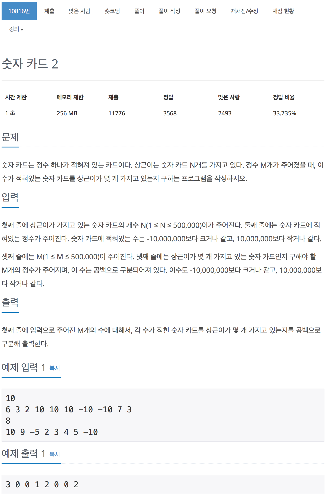

# 백준 10816 - 숫자카드2

[10816 - 숫자카드2 (lower_bound)](https://www.acmicpc.net/problem/10816)



### lower_bound

찾고자 하는 값`target`이상 처음 나타나는 위치를 찾고자 할때 사용한다.  
즉, `arr[mid-1] < target` 이면서 `target <= arr[mid]`을 만족하는  
`mid`값을 찾고자 하는 것이 목표이다.

```cpp
int lower_bound(int target)
{
    int start, mid, end;
    start = 0;
    end = n;

    while (end > start)
    {
        mid = (start + end) / 2;

        // target이 arr의 mid값 보다 작거나 같을 경우
        //오른쪽에서 왼쪽으로 범위가 좀혀 온다.
        if (target <= arr[mid])
            end = mid;
        // target이 arr의 mid보다 클 경우
        // 왼쪽에서 오른쪽으로 범위가 좁혀 온다.
        else
        {
            start = mid + 1;
        }
    }
    return end;
}
```

```cpp
int lower_bound(int target)
{
    int start, mid, end;
    start = 0;
    end = n;

    while (end > start)
    {
        mid = (start + end) / 2;

        // target이 arr[mid]의 값보다 클때만 start값이 갱신된다.
        if(target > arr[mid])
            start = mid + 1;
        // target이 arr[mid]의 값보다 작거나 같을 때는 end값이 갱신된다.
        // target == arr[mid]일때 왼쪽이 줄어는게 아니라 오른쪽범위가 줄어든 다는 것을 이해하자!
        else
        {
            end = mid;
        }
    }
    return end;
}
```

생각하다가 보니 이 코드가 직관적으로 이해하기 더 쉬울 것 같아서 추가!

<br>

### upper_bound

찾고자 하는 값 `target`을 초과하는 위치를 찾고자 할 때 사용하는 함수이다.  
즉, `arr[mid-1] <= target`이면서 `target < arr[mid]`을 만족하는  
`mid`를 찾고자 하는 것이다.

```cpp
int upper_bound(int target)
{
    int start, end, mid;
    start = 0;
    end = n;

    while (end > start)
    {
        mid = (start + end) / 2;

        if (target < arr[mid])
            end = mid;
        else
        {
            start = mid + 1;
        }
    }
    return end;
}
```

### 처음 푼 방법

```cpp
#include <iostream>
#include <algorithm>
using namespace std;

int arr[500001];
int n, m;

int lower_bound(int target)
{
    int start, mid, end;
    start = 0;
    end = n;

    while (end > start)
    {
        mid = (start + end) / 2;

        if (target <= arr[mid])
            end = mid;
        else
        {
            start = mid + 1;
        }
    }
    return end;
}

int find(int start_index, int target)
{
    int n = 0;
    while (arr[start_index] == target)
    {
        n++;
        start_index++;
    }
    return n;
}

int main(void)
{
    scanf("%d", &n);
    for (int i = 0; i < n; i++)
    {
        scanf("%d", &arr[i]);
    }
    sort(arr, arr + n);

    scanf("%d", &m);
    for (int i = 0; i < m; i++)
    {
        int target, start_index, num;
        scanf("%d", &target);
        start_index = lower_bound(target);
        num = find(start_index, target);
        printf("%d ", num);
    }
    return 0;
}
```

시간 오류가 떳다.  
아마도 find에서 시간을 많이 잡아먹는 것 같다.

### 나중에 푼 방법

```cpp
#include <iostream>
#include <algorithm>
using namespace std;

int arr[500001];
int n, m;

int lower_bound(int target)
{
    int start, mid, end;
    start = 0;
    end = n;

    while (end > start)
    {
        mid = (start + end) / 2;

        if (target <= arr[mid])
            end = mid;
        else
        {
            start = mid + 1;
        }
    }
    return start;
}

int upper_bound(int target)
{
    int start, end, mid;
    start = 0;
    end = n;

    while (end > start)
    {
        mid = (start + end) / 2;

        if (target < arr[mid])
            end = mid;
        else
        {
            start = mid + 1;
        }
    }
    return end;
}
int main(void)
{
    scanf("%d", &n);
    for (int i = 0; i < n; i++)
    {
        scanf("%d", &arr[i]);
    }

    sort(arr, arr + n);

    scanf("%d", &m);
    for (int i = 0; i < m; i++)ㅍㅍ
    {
        int target, start_index, end_index = 0;
        scanf("%d", &target);
        start_index = lower_bound(target);
        end_index = upper_bound(target);
        printf("%d ", end_index - start_index);
    }
    return 0;
}
```

upper_bound와 lower_bound 두개 다 사용해서 문제를 해결 했다.
