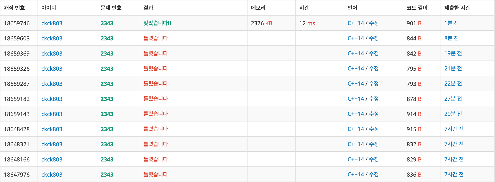

# 백준 2343 - 기타 레슨


## 체점 현황



## 틀린 이유 1

```cpp
for (int i = 0; i < N; i++) {
    cin >> v[i];
}

sort(v.begin(), v.end());
```

문제 조건에서 들어온 순서대로 녹음을 한다고 했는데... 정렬을 해버려서 오지게 틀렸다.

## 틀린 이유 2

```cpp
while (start <= finish) {
    int mid = (start + finish) / 2;
    int cntM = 1;
    int sum = 0;

    for (int i = 0; i < N; i++) {
        sum += v[i];
        if (sum > mid) {
            cntM++;
            sum = v[i];
        }
    }

    if (cntM > M) {
        start = mid + 1;
    } else {
        finish = mid - 1;
    }
}
```

이렇게 코드를 짯을 경우 블루레이에 저장할 수 있는 레슨의 길이가 기타 레슨의 길이보다 짧을 경우에 대해 해결을 하지 못하는 코드가 된다.

## 문제 풀이

블루레이 최소 크기를 찾아야 한다. 또한 `M`개의 블루레이는 모두 같은 크기라는 것이 보장 되어 있다. 블루레이 크기에 대한 정보를 찾을 수 없으므로 탐색을 해야 하는데, 일반적인 탐색을 이용하면 시간초과가 나므로 이분탐색을 이용하여 블루레이 최소 크기를 찾아야 한다.

1. 들어오는 레슨의 순서들 중에서 최대 레슨의 길이를 `finish`값으로 잡는다.
2. 이분탐색을 시작한다.
3. 조건식에서 true로 반환된 경우에는 필요한 블루레이 갯수가 `M`보다 크므로 `mid`값을 높이는 방향으로 `false`인 경우에는 `mid`값을 낮추는 방향으로 간다.

### 이분 탐색 조건식

1. 주어진 레슨들을 더해가면서 `mid`값보다 커지면 블루레이 갯수를 증가시키고, 해당 값부터 시작해 다시 더해간다.
2. 블루레이 갯수가 주어진 `M`보다 작은 경우에는 `true`를 아니면 `false`를 반환한다.
3. 만약 한 레슨이 `mid`보다 큰 경우에는 그냥 `true`를 반환한다.

## 전체 소스 코드

```cpp
#include <bits/stdc++.h>
using namespace std;

int N, M;
vector<int> v;

bool cmp(int mid) {
    int cntM = 1;
    int sum = 0;

    for (int i = 0; i < N; i++) {
        if (v[i] > mid) {
            return true;
        }

        sum += v[i];
        if (sum > mid) {
            sum = v[i];
            cntM++;
        }
    }

    return cntM > M;
}

int main(void) {
    cin.tie(0);
    cout.tie(0);
    ios_base::sync_with_stdio(false);
    cin >> N >> M;
    v = vector<int>(N);
    int limit = 0;

    for (int i = 0; i < N; i++) {
        cin >> v[i];
        limit += v[i];
    }

    int start, finish;
    start = 1;
    finish = limit;
    int answer = 0;

    while (start <= finish) {
        int mid = (start + finish) / 2;

        if (cmp(mid)) {
            start = mid + 1;
        } else {
            finish = mid - 1;
        }
    }

    cout << start << '\n';
    return 0;
}
```
