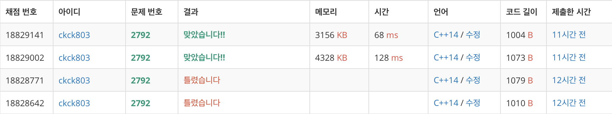

# 백준 2792 - 보석 상자


## 채점 현황



## 틀린 이유

```cpp
bool inN(int value) {
    int maxValue = 0;
    int num = 0;
    for (int i = 0; i < M; i++) {
        num += (jewelry[i] / value);

        maxValue = max(maxValue, value + (jewelry[i] % value));
    }

    if (num <= N) {
        answer = min(answer, maxValue);
        return true;
    } else {
        return false;
    }
}
```

보기의 힌트를 보고 코드를 짠게 독이 되었다... 이런 식으로 짜게 되면 갱신을 제대로 못하는 경우가 생긴다. 특히, `jewelry[i]`의 개수가 `value`보다 작을 경우에는 `num`을 카운트 하지 않고 넘어가는 경우가 생기게 된다.

## 문제 풀이

전형적인 이분탐색 문제이다. `1 ~ 10`억개 까지의 보석중에서 개인이 가질 수 있는 최소의 `M`개를 찾는 것이다.

## 조건식

```cpp
bool inN(int value) {
    int maxValue = 0;
    int num = 0;
    for (int i = 0; i < M; i++) {
        num += (jewelry[i] / value);
        if (jewelry[i] % value) {
            num++;
        }
    }

    if (num <= N) {
        answer = min(answer, value);
        return true;
    } else {
        return false;
    }
}
```

`M`개의 보석 종류를 돌면서 `value`로 나눈 값을 더해간다. `value`로 나눈 값은 해당 보석을 갖는 사람의 수이다. 만일 나눈 값의 나머지가 있을 경우, 나머지를 갖는 사람도 추가를 해준다.

## 전체 소스 코드

```cpp
#include <bits/stdc++.h>
using namespace std;

int N, M;
vector<int> jewelry;
int answer = INT_MAX;

bool inN(int value) {
    int maxValue = 0;
    int num = 0;
    for (int i = 0; i < M; i++) {
        num += (jewelry[i] / value);
        if (jewelry[i] % value) {
            num++;
        }
    }

    if (num <= N) {
        answer = min(answer, value);
        return true;
    } else {
        return false;
    }
}

int main(void) {
    cin.tie(0);
    cout.tie(0);
    ios_base::sync_with_stdio(false);
    cin >> N >> M;
    jewelry = vector<int>(M);

    int length = 0;
    for (int i = 0; i < M; i++) {
        cin >> jewelry[i];

        if (jewelry[i] > length) {
            length = jewelry[i];
        }
    }

    int start = 1;
    int finish = length;
    while (start <= finish) {
        int mid = (start + finish) / 2;

        if (inN(mid)) {
            finish = mid - 1;
        } else {
            start = mid + 1;
        }
    }
    cout << answer << '\n';
    return 0;
}
```
