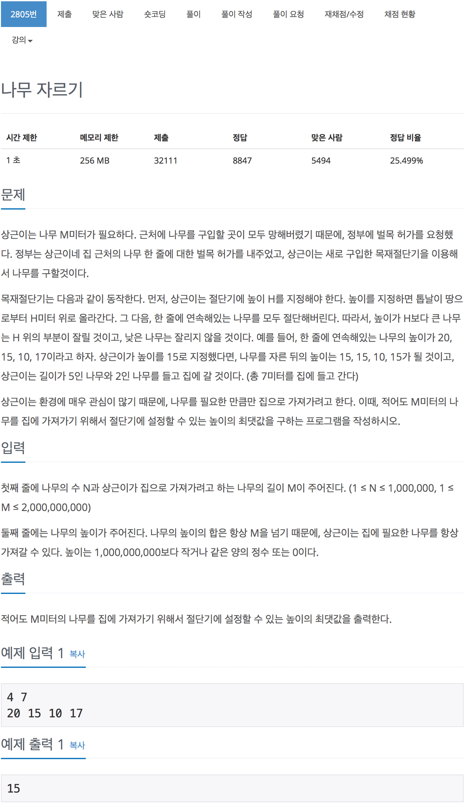

# 백준 2805 - 나무 자르기

[2805 - 나무 자르기](https://www.acmicpc.net/problem/2805)



```cpp
while (start <= end)
{
    long long mid = (start + end) / 2;
    long long sum = 0;

    for (int i = 0; i < n; i++)
    {
        if (tree[i] < mid)
            continue;
        sum += (tree[i] - mid);
    }

    // cout << start << " " << end << " " << mid << endl;
    // cout << sum << " " << m << endl;

    // 자른 합계가 목표치 보다 클거나 같을 때
    if (sum >= m)
    {
        start = mid + 1;
    }
    else
    {
        end = mid - 1;
    }
}
```

```cpp
#include <iostream>
#include <vector>
using namespace std;

int n, m;
long long max_tree;
long long max_length;

int main(void)
{
    scanf("%d %d", &n, &m);
    vector<long long> tree(n);

    for (int i = 0; i < n; i++)
    {
        long long temp;
        scanf("%lld", &temp);
        tree[i] = temp;
        if (max_tree < temp)
            max_tree = temp;
    }

    long long start = 1;
    long long end = max_tree;

    while (start <= end)
    {
        long long mid = (start + end) / 2;
        long long sum = 0;

        for (int i = 0; i < n; i++)
        {
            if (tree[i] < mid)
                continue;
            sum += (tree[i] - mid);
        }

        // cout << start << " " << end << " " << mid << endl;
        // cout << sum << " " << m << endl;

        // 자른 합계가 목표치 보다 클거나 같을 때
        if (sum >= m)
        {
            start = mid + 1;
        }
        else
        {
            end = mid - 1;
        }
    }

    printf("%lld", end);
    return 0;
}
```
