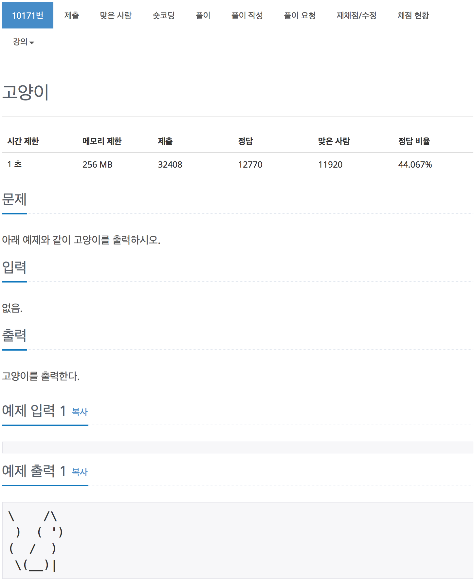

# 백준 10171 - 토끼

[10171 - 토끼](https://www.acmicpc.net/problem/10171)



```cpp
#include <iostream>
using namespace std;

int main(void)
{
    cout << "\\    /\\" << endl;
    cout << " )  ( ')" << endl;
    cout << "(  /  )" << endl;
    cout << " \\(__)| " << endl;
    return 0;
}
```
