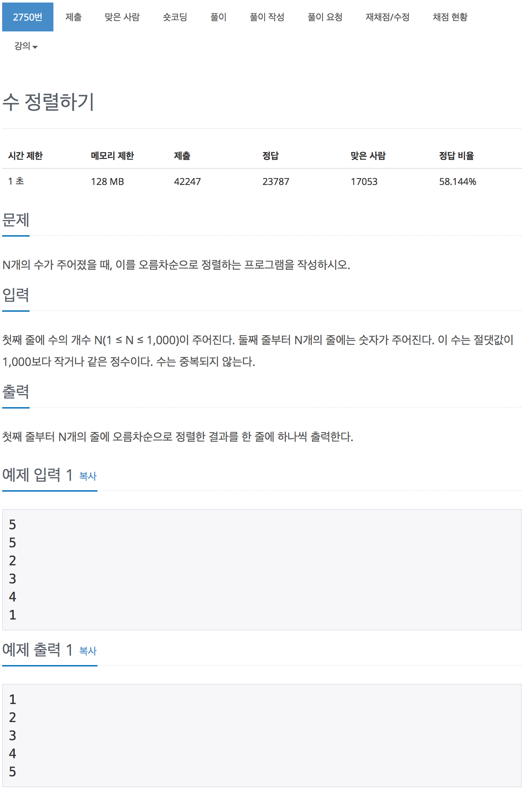

# 백준 2750 - 수 정렬하기

[2750 - 수 정렬하기](https://www.acmicpc.net/problem/2750)



```cpp
#include <iostream>
using namespace std;

int arr[1001];
int n;

int main(void)
{
    cin >> n;
    for (int i = 0; i < n; i++)
    {
        cin >> arr[i];
    }

    for (int i = 0; i < n; i++)
    {
        for (int j = 0; j < n - i - 1; j++)
        {
            if (arr[j] > arr[j + 1])
            {
                int temp = arr[j];
                arr[j] = arr[j + 1];
                arr[j + 1] = temp;
            }
        }
    }

    for (int i = 0; i < n; i++)
    {
        cout << arr[i] << '\n';
    }

    return 0;
}
```
