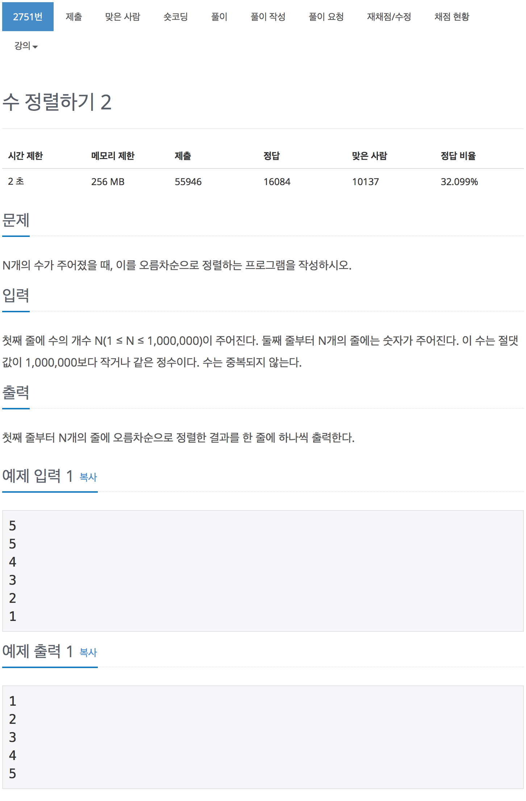

# 백준 2751 - 수 정렬하기2

[2751 - 수 정렬하기2](https://www.acmicpc.net/problem/2751)



```cpp
#include <iostream>
using namespace std;

#define MAX_RANGE 10000000

int n;
int a[MAX_RANGE];
int b[MAX_RANGE];

void merge(int start, int end)
{
    int mid = (start + end) / 2;
    int index = 0;

    int block1 = start;
    int block2 = mid + 1;

    while (block1 <= mid && block2 <= end)
    {
        if (a[block1] < a[block2])
        {
            b[index++] = a[block1++];
        }
        else
        {
            b[index++] = a[block2++];
        }
    }

    // block2에 있는 모든 값들이 배열 b에 옮겨진 경우에
    while (block1 <= mid)
    {
        b[index++] = a[block1++];
    }

    // block1에 있는 모든 값들이 배열 b에 옮겨진 경우에
    while (block2 <= end)
    {
        b[index++] = a[block2++];
    }

    // 정렬된 데이터b를 배열a로 옮겨 준다.
    for (int i = start; i <= end; i++)
    {
        a[i] = b[i - start];
    }
}

void sort(int start, int end)
{
    if (start == end)
    {
        return;
    }

    int mid = (start + end) / 2;

    sort(start, mid);
    sort(mid + 1, end);
    merge(start, end);
}

int main(void)
{
    scanf("%d", &n);
    for (int i = 0; i < n; i++)
    {
        scanf("%d", &a[i]);
    }

    sort(0, n - 1);

    for (int i = 0; i < n; i++)
    {
        printf("%d\n", a[i]);
    }

    return 0;
}
```
