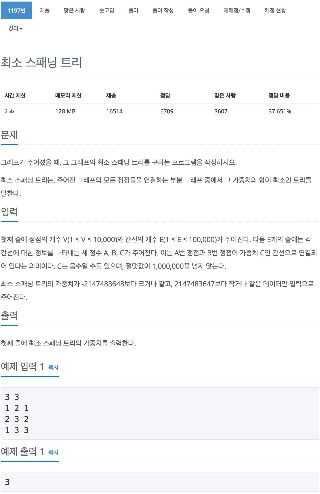

# 백준 1197 - 최소 스패닝 트리

[1197 - 최소 스패닝 트리](https://www.acmicpc.net/problem/1197)


```cpp
#include <iostream>
#include <algorithm>
using namespace std;

int v, e, a, b, c, i, cnt, sum;
struct edge
{
    int weight, from, to;
};

bool operator<(const edge &e1, const edge &e2)
{
    return e1.weight < e2.weight;
}

edge E[100001];
int parent[100001];
int find(int x)
{
    if (x == parent[x])
        return x;
    return parent[x] = find(parent[x]);
}

void merge(int x, int y)
{
    x = parent[x];
    y = parent[y];
    parent[x] = y;
}

int main(void)
{
    scanf("%d %d", &v, &e);
    for (int i = 0; i < e; i++)
    {
        scanf("%d %d %d", &a, &b, &c);
        E[i] = {c, a, b};
    }

    for (int i = 1; i <= v; i++)
        parent[i] = i;
    sort(E, E + e);

    i = 0;
    while (cnt != v - 1)
    {
        a = E[i].from;
        b = E[i].to;
        if (find(a) != find(b))
        {
            merge(a, b);
            cnt++;
            sum += E[i].weight;
        }
        i++;
    }
    printf("%d", sum);
    return 0;
}
```

## 1197_2.cpp

```cpp
#include <iostream>
#include <algorithm>
#include <vector>
using namespace std;

#define MAX 10001

// 입력
// 첫째 줄에 정점의 개수 V와 간선의 개수 E가 주어진다.
// E개의 줄에는 각 간선에 대한 정보를 나타내는 세 정수 A,B,C가 주저진다.
// A번 정점과 B번 정점이 가중치 C인 간선으로 연결되어 있다는 의미이다.
// C는 음수 일 수도 있으며, 절대값이 1,000,000을 넘지 않는다.

// 입력
int V, E;
vector<pair<int, pair<int, int>>> vertex;
int parent[MAX];

// 출력
// 첫번째 줄에 최소 스패닝 트리의 가중치를 출력한다.
int gweight;

int find(int a)
{
    if (a == parent[a])
        return a;
    return parent[a] = find(parent[a]);
}

void merge(int a, int b)
{
    parent[b] = a;
}

int main(void)
{
    cin >> V >> E;
    for (int i = 0; i < E; i++)
    {
        int A, B, C;
        cin >> A >> B >> C;
        vertex.push_back({C, {A, B}});
    }

    for (int i = 0; i <= V; i++)
    {
        parent[i] = i;
    }

    sort(vertex.begin(), vertex.end());

    int vertexNum = 1;
    for (int i = 0; i < E; i++)
    {
        int from = vertex[i].second.first;
        int to = vertex[i].second.second;
        int weight = vertex[i].first;

        int setA = find(from);
        int setB = find(to);

        if (setA != setB)
        {
            merge(setA, setB);
            gweight += weight;
            vertexNum++;
        }

        // 모든 정점이 다 이어진 경우 탈출한다.
        if (vertexNum == V)
            break;
    }

    cout << gweight << '\n';

    return 0;
}

```
