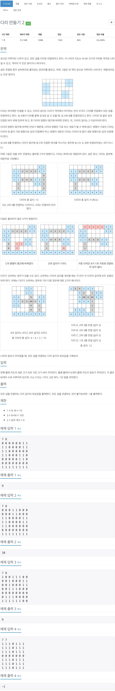
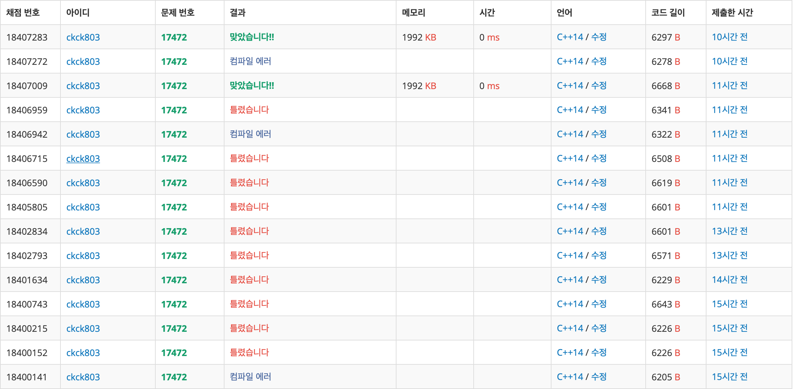

# 다리 만들기 2



## 체점 현황


진짜 오지게 틀렸다...

## 틀린 이유 1

```cpp
void cero_bfs(int y, int x, int area, queue<point> q) {
    vector<vector<bool>> check(N, vector<bool>(N, false));

....
void garo_bfs(int y, int x, int area, queue<point> q) {
    vector<vector<bool>> check(N, vector<bool>(N, false));

....

queue<point> search_bfs(int y, int x, int area) {
    vector<vector<bool>> check(N, vector<bool>(N, false));

....

void color_bfs(int y, int x, int area) {
    vector<vector<bool>> check(N, vector<bool>(N, false));

```

처음 문제를 봤을 때 지도가 `N x N` 형태의 지도를 주는 줄 알고 모든 배열을 `N x N`형태로 선언한 다음에 `N x M` 형태인줄 알고 바꿨으나 미처 바꾸지 못한 것들 때문에 엄청 틀렸다.

> `vector`로 2차원 배열 쓰는 걸 자제하자.... 가독성이 무척이나 떨어진다.  
> 2차원 배열 사용 한 후 `memset`을 사용하자

## 틀린 이유 2

```cpp
if (map[cntY][cntX] == 1 && colorMap[cntY][cntX] != area) {
    if (cntNum - 1 > 1) {
        int from = area;
        int to = colorMap[cntY][cntX];

        if (bridge[from][to] > cntNum) {
            bridge[from][to] = cntNum - 1;
            bridge[to][from] = cntNum - 1;
        }
    }
    continue;
}
```
`cntNum-1`이 실제 다리 길이 인데, 기존의 다리의 길이와 비교 할때 `cntNum`으로 해버려서 틀렸다.

> 햇깔리기 싫으면 따로 변수를 선언해서 문제를 접근하자.

## 문제 접근

문제에서는 섬들간에 다리를 연결하여 모든 섬들을 이어주기를 원하고, 이 다리의 최소 길이를 요구하고 있다. 섬들을 하나의 정점으로 보고 다리를 간선으로 본다고 하면 결국 그래프 이어주기 문제가 되는데, 길이를 weight라 생각하면 `간선의 weight의 합이 최소`인 것을 요구하므로 `MST(최소 신장 트리)`를 만들 것을 요구한다고 생각 했다.

1. 각 섬들에 번호를 매겨주기
2. 각 섬들간의 다리 최소 다리 길이 구하기
3. 간선을 선택해서 그래프들을 이어주기
   1. 사이클이 발생하는지 확인하기
   2. 사이클이 발생하지 않는다고 하면 선택하기
   3. 사이클이 발생한다고 하면 해당 간선을 선택하지 않고 다음으로 넘어가기

## 섬에 번호 매겨주기
```cpp
void color_bfs(int y, int x, int color) {
    bool check[11][11];
    memset(check, false, sizeof(check));

    queue<pair<int, int>> q;
    q.push({y, x});
    check[y][x] = true;
    colorMap[y][x] = color;

    while (!q.empty()) {
        int cntY = q.front().first;
        int cntX = q.front().second;
        q.pop();

        for (int i = 0; i < 4; i++) {
            int ny = cntY + dy[i];
            int nx = cntX + dx[i];

            if (0 <= ny && ny < N && 0 <= nx && nx < M) {
                if (check[ny][nx] == false && map[ny][nx] == 1) {
                    colorMap[ny][nx] = color;
                    check[ny][nx] = true;
                    q.push({ny, nx});
                }
            }
        }
    }
}
```

`map[y][x]` : 처음 주어진 지도   
`colorMap[y][x]` : 색칠된 지도  
`BFS`를 이용하여 색칠하기를 진행 해주었다.


## 길이 구하기

```cpp

queue<point> search_bfs(int y, int x, int area) {
    bool check[11][11];
    memset(check, false, sizeof(check));

    queue<pair<int, int>> q;
    queue<point> local;

    q.push({y, x});
    local.push({y, x, 0});
    check[y][x] = true;

    while (!q.empty()) {
        int cntY = q.front().first;
        int cntX = q.front().second;
        q.pop();

        for (int i = 0; i < 4; i++) {
            int ny = cntY + dy[i];
            int nx = cntX + dx[i];

            if (0 <= ny && ny < N && 0 <= nx && nx < M) {
                if (check[ny][nx] == false && map[ny][nx] == 1 && colorMap[ny][nx] == area) {
                    check[ny][nx] = true;
                    q.push({ny, nx});
                    local.push({ny, nx, 0});
                }
            }
        }
    }

    return local;
}

// 세로로 다리 놓기
void cero_bfs(int y, int x, int area) {
    bool check[11][11];
    memset(check, false, sizeof(check));

    queue<point> q = search_bfs(y, x, area);
    check[q.front().y][q.front().x] = true;

    while (!q.empty()) {
        int cntY = q.front().y;
        int cntX = q.front().x;
        int cntNum = q.front().num;
        q.pop();

        if (map[cntY][cntX] == 1 && colorMap[cntY][cntX] != area) {
            int bridge_length = cntNum - 1;

            if (bridge_length > 1) {
                int from = area;
                int to = colorMap[cntY][cntX];

                if (bridge[from][to] > bridge_length) {
                    bridge[from][to] = bridge_length;
                    bridge[to][from] = bridge_length;
                }
            }
            continue;
        }
        for (int i = 2; i < 4; i++) {
            int ny = cntY + dy[i];
            int nx = cntX + dx[i];

            if (0 <= ny && ny < N && 0 <= nx && nx < M) {
                if (check[ny][nx] == false && colorMap[ny][nx] != area) {
                    check[ny][nx] = true;
                    q.push({ny, nx, cntNum + 1});
                }
            }
        }
    }
}

// 가로로 다리 놓기
void garo_bfs(int y, int x, int area) {
    bool check[11][11];
    memset(check, false, sizeof(check));

    queue<point> q = search_bfs(y, x, area);
    check[q.front().y][q.front().x] = true;

    while (!q.empty()) {
        int cntY = q.front().y;
        int cntX = q.front().x;
        int cntNum = q.front().num;
        q.pop();

        if (map[cntY][cntX] == 1 && colorMap[cntY][cntX] != area) {
            int bridge_length = cntNum - 1;
            if (cntNum - 1 > 1) {
                int from = area;
                int to = colorMap[cntY][cntX];

                if (bridge[from][to] > bridge_length) {
                    bridge[from][to] = bridge_length;
                    bridge[to][from] = bridge_length;
                }
            }
            continue;
        }

        for (int i = 0; i < 2; i++) {
            int ny = cntY + dy[i];
            int nx = cntX + dx[i];

            if (0 <= ny && ny < N && 0 <= nx && nx < M) {
                if (check[ny][nx] == false && colorMap[ny][nx] != area) {
                    check[ny][nx] = true;
                    q.push({ny, nx, cntNum + 1});
                }
            }
        }
    }
}
```

`search_bfs`라고 해서 해당 지역의 모든 땅들을 탐색하게 했지만 문제를 풀다가 생각난게 처음에 색칠하기 할때 색칠하면서 queue배열 혹은 vector배열로 관리를 하는 방법이 있다고 생각했지만... 코드를 다 갈아 엎어야 해서 있는 그대로 냅두었다.  
1. 해당 area에 속하는 모든 땅들을 탐색
2. 해당 area에서 다른 area에 도착할 때까지 bfs를 진행 시켜준다.
3. 다른 area에 도착하게 되면 다리의 길이 상태는 해당 땅까지 포함되어 있는 상태라 -1을 해준다.`(cntNum - 1)`
4. 만약 다리의 길이가 1보다 작은 경우에는 해당 경우를 진행하지 않고 다음 경우로 넘어가게 한다.`(continue)`
5. 다리의 길이가 최소인 경우 값을 갱신해 준다. (다리는 양 방향이므로 `from -> to`, `to -> from`모두 같은 값을 넣어주어야 한다.)

## 간선들 구하기

```cpp
for (int i = 1; i <= color; i++) {
    for (int j = i; j <= color; j++) {
        if (bridge[i][j] != INF) {
            edges.push_back({i, j, bridge[i][j]});
        }
    }
}

sort(edges.begin(), edges.end(), cmp);
```
간선은 `양 방향`이므로 한쪽 구역만 탐색을 하면서 길이가 존재하는 간선들을 가져온다음  
`오름차순`으로 정렬한다.


## 그래프 만들기
```cpp
for (int i = 0; i < 7; i++) {
    parent[i] = i;
}

int i = 0;
int cnt = 0;
int sum = 0;
while (cnt != color - 1 && i < edges.size()) {
    int a = edges[i].from;
    int b = edges[i].to;

    if (find(a) != find(b)) {
        merge(a, b);
        cnt++;
        sum += edges[i].weight;
    }
    i++;
}
if (cnt == color - 1) {
    cout << sum << '\n';
} else {
    cout << -1 << '\n';
}
```
`크루스칼 알고리즘`을 통해서 최소 스패팅 트리 만들기를 진행 해주면 된다.  
`cnt == color - 1`인 상태가 그래프가 완성된 상태 만약 작을 경우에는 모든 정점이 이어진 경우가 아니므로 `-1`을 반환하면 된다.

## 전체 소스 코드

```cpp
#include <algorithm>
#include <cstring>
#include <iostream>
#include <queue>
using namespace std;

#define INF 987654321

int N, M;
int map[11][11];
int colorMap[11][11];
int dx[4] = {1, -1, 0, 0};
int dy[4] = {0, 0, 1, -1};
int bridge[7][7];
int parent[7];

struct point {
    int y;
    int x;
    int num;
};

struct edge {
    int from;
    int to;
    int weight;
};

bool cmp(edge a, edge b) {
    return a.weight < b.weight;
}

vector<edge> edges;

queue<point> search_bfs(int y, int x, int area) {
    bool check[11][11];
    memset(check, false, sizeof(check));

    queue<pair<int, int>> q;
    queue<point> local;

    q.push({y, x});
    local.push({y, x, 0});
    check[y][x] = true;

    while (!q.empty()) {
        int cntY = q.front().first;
        int cntX = q.front().second;
        q.pop();

        for (int i = 0; i < 4; i++) {
            int ny = cntY + dy[i];
            int nx = cntX + dx[i];

            if (0 <= ny && ny < N && 0 <= nx && nx < M) {
                if (check[ny][nx] == false && map[ny][nx] == 1 && colorMap[ny][nx] == area) {
                    check[ny][nx] = true;
                    q.push({ny, nx});
                    local.push({ny, nx, 0});
                }
            }
        }
    }

    return local;
}

// 세로로 다리 놓기
void cero_bfs(int y, int x, int area) {
    bool check[11][11];
    memset(check, false, sizeof(check));

    queue<point> q = search_bfs(y, x, area);
    check[q.front().y][q.front().x] = true;

    while (!q.empty()) {
        int cntY = q.front().y;
        int cntX = q.front().x;
        int cntNum = q.front().num;
        q.pop();

        if (map[cntY][cntX] == 1 && colorMap[cntY][cntX] != area) {
            int bridge_length = cntNum - 1;

            if (bridge_length > 1) {
                int from = area;
                int to = colorMap[cntY][cntX];

                if (bridge[from][to] > bridge_length) {
                    bridge[from][to] = bridge_length;
                    bridge[to][from] = bridge_length;
                }
            }
            continue;
        }
        for (int i = 2; i < 4; i++) {
            int ny = cntY + dy[i];
            int nx = cntX + dx[i];

            if (0 <= ny && ny < N && 0 <= nx && nx < M) {
                if (check[ny][nx] == false && colorMap[ny][nx] != area) {
                    check[ny][nx] = true;
                    q.push({ny, nx, cntNum + 1});
                }
            }
        }
    }
}

// 가로로 다리 놓기
void garo_bfs(int y, int x, int area) {
    bool check[11][11];
    memset(check, false, sizeof(check));

    queue<point> q = search_bfs(y, x, area);
    check[q.front().y][q.front().x] = true;

    while (!q.empty()) {
        int cntY = q.front().y;
        int cntX = q.front().x;
        int cntNum = q.front().num;
        q.pop();

        if (map[cntY][cntX] == 1 && colorMap[cntY][cntX] != area) {
            int bridge_length = cntNum - 1;
            if (cntNum - 1 > 1) {
                int from = area;
                int to = colorMap[cntY][cntX];

                if (bridge[from][to] > bridge_length) {
                    bridge[from][to] = bridge_length;
                    bridge[to][from] = bridge_length;
                }
            }
            continue;
        }

        for (int i = 0; i < 2; i++) {
            int ny = cntY + dy[i];
            int nx = cntX + dx[i];

            if (0 <= ny && ny < N && 0 <= nx && nx < M) {
                if (check[ny][nx] == false && colorMap[ny][nx] != area) {
                    check[ny][nx] = true;
                    q.push({ny, nx, cntNum + 1});
                }
            }
        }
    }
}

void color_bfs(int y, int x, int color) {
    bool check[11][11];
    memset(check, false, sizeof(check));

    queue<pair<int, int>> q;
    q.push({y, x});
    check[y][x] = true;
    colorMap[y][x] = color;

    while (!q.empty()) {
        int cntY = q.front().first;
        int cntX = q.front().second;
        q.pop();

        for (int i = 0; i < 4; i++) {
            int ny = cntY + dy[i];
            int nx = cntX + dx[i];

            if (0 <= ny && ny < N && 0 <= nx && nx < M) {
                if (check[ny][nx] == false && map[ny][nx] == 1) {
                    colorMap[ny][nx] = color;
                    check[ny][nx] = true;
                    q.push({ny, nx});
                }
            }
        }
    }
}

int find(int x) {
    if (x == parent[x]) {
        return x;
    } else {
        return parent[x] = find(parent[x]);
    }
}
void merge(int a, int b) {
    int set_a = parent[a];
    int set_b = parent[b];

    parent[set_a] = set_b;
}

int main(void) {
    cin >> N >> M;

    for (int i = 0; i < N; i++) {
        for (int j = 0; j < M; j++) {
            cin >> map[i][j];
        }
    }

    for (int i = 0; i < 7; i++) {
        for (int j = 0; j < 7; j++) {
            bridge[i][j] = INF;
        }
    }

    int color = 0;
    for (int i = 0; i < N; i++) {
        for (int j = 0; j < M; j++) {
            if (map[i][j] == 1 && colorMap[i][j] == 0) {
                color++;
                color_bfs(i, j, color);
            }
        }
    }

    vector<bool> area_check(color, false);
    for (int i = 0; i < N; i++) {
        for (int j = 0; j < M; j++) {
            int cntColor = colorMap[i][j];
            if (map[i][j] == 1 && !area_check[cntColor]) {
                area_check[cntColor] = true;
                cero_bfs(i, j, cntColor);
                garo_bfs(i, j, cntColor);
            }
        }
    }

    for (int i = 1; i <= color; i++) {
        for (int j = i; j <= color; j++) {
            if (bridge[i][j] != INF) {
                edges.push_back({i, j, bridge[i][j]});
            }
        }
    }

    sort(edges.begin(), edges.end(), cmp);

    for (int i = 0; i < 7; i++) {
        parent[i] = i;
    }

    int i = 0;
    int cnt = 0;
    int sum = 0;
    while (cnt != color - 1 && i < edges.size()) {
        int a = edges[i].from;
        int b = edges[i].to;

        if (find(a) != find(b)) {
            merge(a, b);
            cnt++;
            sum += edges[i].weight;
        }
        i++;
    }

    if (cnt == color - 1) {
        cout << sum << '\n';
    } else {
        cout << -1 << '\n';
    }
    return 0;
}
```