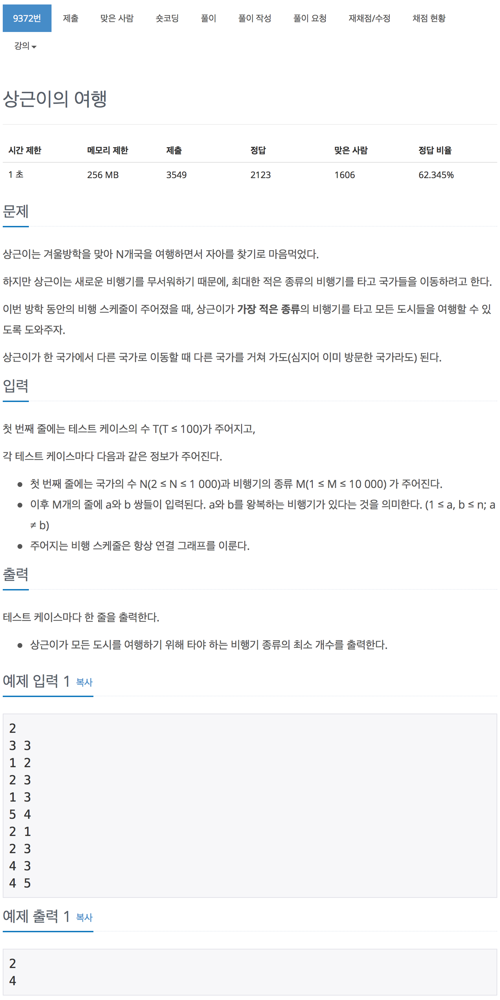

# 백준 9372 - 상근이의 여행

[9372 - 상근이의 여행](https://www.acmicpc.net/problem/9372)



```cpp
#include <iostream>
#include <vector>
#include <queue>
using namespace std;

#define MAX 1001;

int n, m;

int main(void)
{
    int t;
    cin >> t;

    while (t--)
    {
        cin >> n >> m;

        for (int i = 0; i < m; i++)
        {
            int node1, node2;
            cin >> node1 >> node2;
        }
        cout << n - 1 << '\n';
    }
    return 0;
}
```
