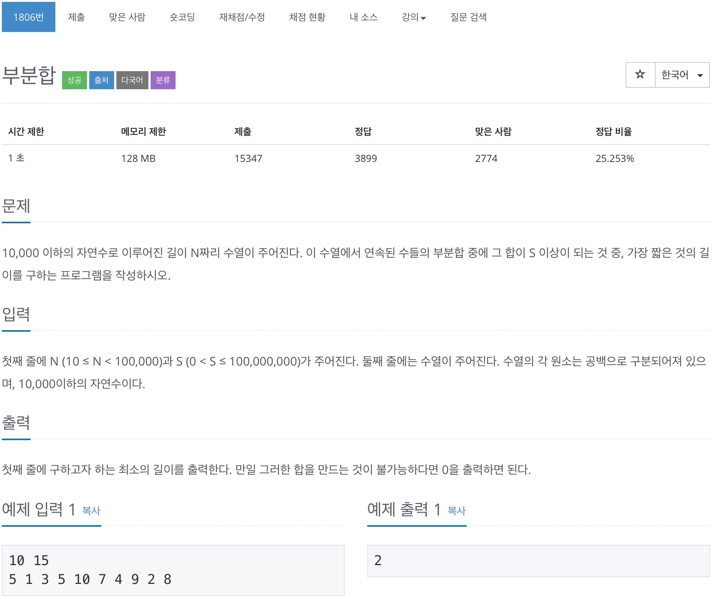

# 백준 1806 - 부분합



## 전체 소스 코드
```cpp
#include <bits/stdc++.h>
using namespace std;

int n, m;
vector<int> v;
int min_length = 987654321;

int main(void) {
    cin.tie(0);
    cout.tie(0);
    ios_base::sync_with_stdio(false);

    cin >> n >> m;
    v = vector<int>(n);
    for (int i = 0; i < n; i++) {
        cin >> v[i];
    }

    bool isPossible = false;

    int start_point = 0;
    int sum = 0;
    for (int i = 0; i < n; i++) {
        sum += v[i];

        while (sum >= m) {
            isPossible = true;
            min_length = min(min_length, i - start_point);
            sum -= v[start_point++];
        }
    }

    if (!isPossible)
        cout << 0 << '\n';
    else
        cout << min_length + 1 << '\n';
    return 0;
}
```