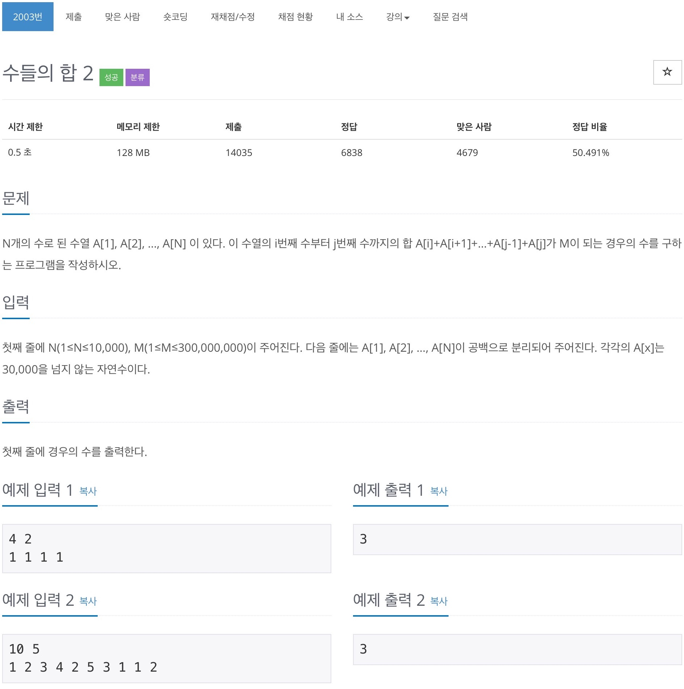

# 백준 2003 - 수들의 합



## 전체 소스 코드
```cpp
#include <bits/stdc++.h>
using namespace std;

int main(void) {
    int n, m;
    cin >> n >> m;
    vector<int> v(n);
    for (int i = 0; i < n; i++) {
        cin >> v[i];
    }

    int start = 0;
    int sum = 0;
    int num = 0;
    for (int i = 0; i < n; i++) {
        sum += v[i];
        while (sum >= m) {
            if (sum == m) {
                num++;
            }
            sum -= v[start++];
        }
    }

    cout << num << endl;
    return 0;
}
```