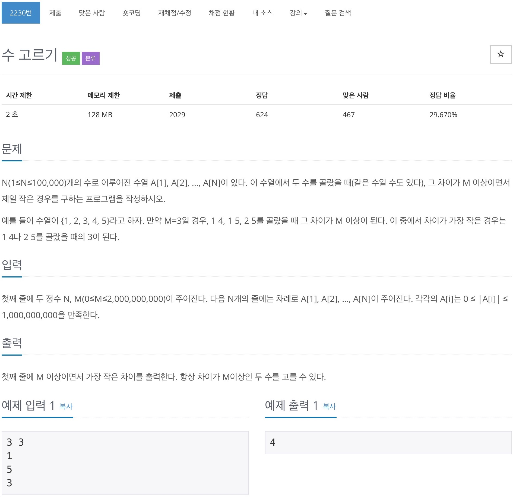

# 백준 2230 - 수 고르기



## 전체 소스 코드 
```cpp
#include <bits/stdc++.h>
using namespace std;

#define endl '\n'

int main(void) {
    int n, m;
    cin >> n >> m;
    vector<int> v(n);
    for (int i = 0; i < n; i++) {
        cin >> v[i];
    }

    sort(v.begin(), v.end());

    int start_point = 0;
    int min_diff = INT_MAX;
    for (int i = 0; i < n; i++) {
        while (start_point < n && v[i] - v[start_point] >= m) {
            min_diff = min(min_diff, (v[i] - v[start_point++]));
        }
    }
    cout << min_diff << endl;
    return 0;
}
```