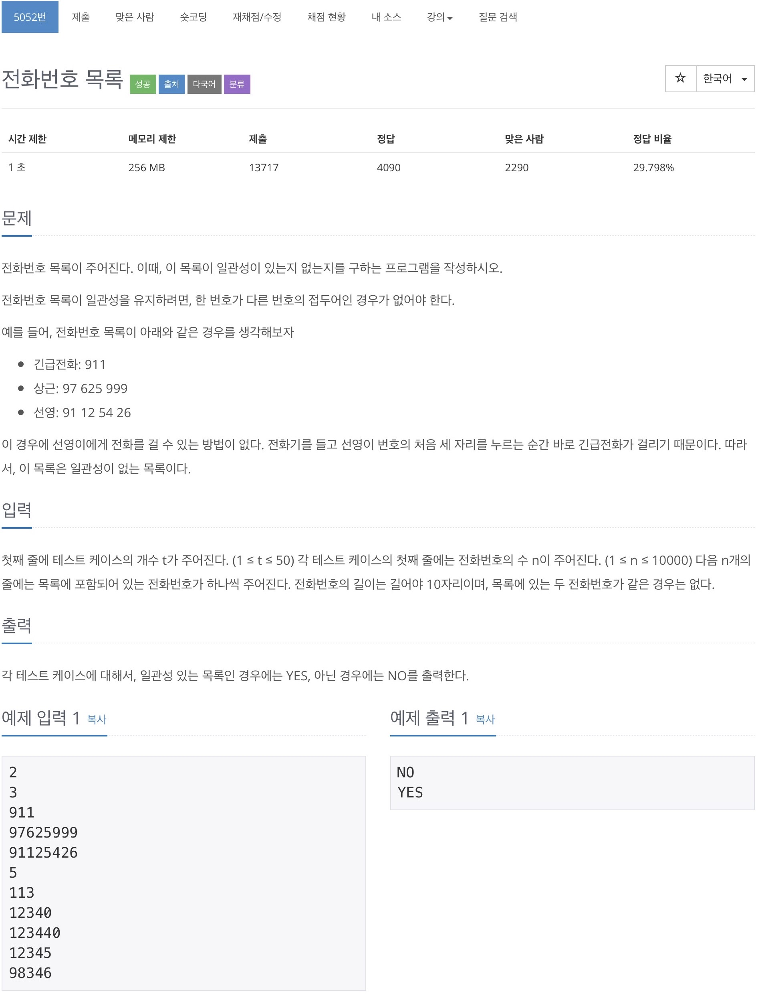
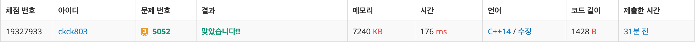

# 백준 5052 - 전화번호 목록



## 채점 현황



## 전체 소스 코드
```cpp
#include <bits/stdc++.h>
using namespace std;

struct trie {
    trie* number[10];
    bool end;

    trie() {
        for (int i = 0; i < 10; i++) {
            number[i] = NULL;
        }
        end = false;
    }

    ~trie() {
        for (int i = 0; i < 10; i++) {
            if (number[i] != NULL) {
                delete number[i];
            }
        }
    }

    void insert(char* str) {
        if (*str == '\0') {
            end = true;
            return;
        }

        int cur = *str - '0';
        if (number[cur] == NULL)
            number[cur] = new trie();
        number[cur]->insert(str + 1);
    }

    bool find(char* str) {
        if (*str == '\0') {
            return false;
        }

        if (end) {
            return true;
        }

        int cur = *str - '0';
        return number[cur]->find(str + 1);
    }
};

int main(void) {
    int t, n;
    char phone_number[10000][10];
    cin >> t;
    while (t--) {
        cin >> n;

        trie* root = new trie();
        for (int i = 0; i < n; i++) {
            cin >> phone_number[i];
            root->insert(phone_number[i]);
        }

        bool ans = true;
        for (int i = 0; i < n; i++) {
            if (root->find(phone_number[i])) {
                ans = false;
                break;
            }
        }

        if (ans)
            cout << "YES" << '\n';
        else {
            cout << "NO" << '\n';
        }

        delete root;
    }

    return 0;
}
```