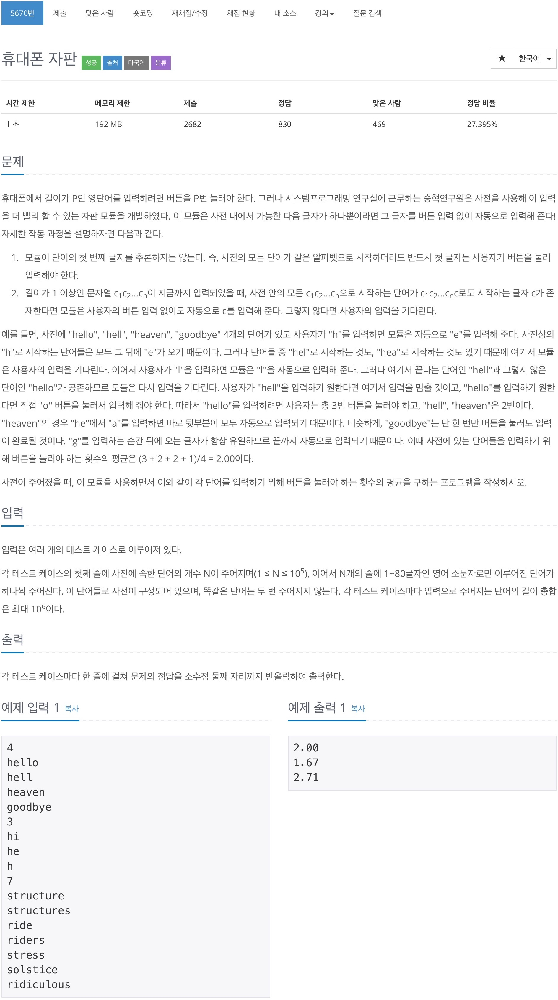

# 백준 5670 - 휴대폰 자판



## 전체 소스 코드
```cpp
#include <iomanip>
#include <iostream>
using namespace std;

int ans, n;
const char* start_point;

struct TrieNode {
    TrieNode* children[26];
    bool terminal;
    int numOfChildren;

    TrieNode() : terminal(false), numOfChildren(0) {
        for (int i = 0; i < 26; i++) children[i] = NULL;
    }

    ~TrieNode() {
        for (int i = 0; i < 26; i++)
            if (children[i])
                delete children[i];
    }

    void insert(const char* str) {
        if (*str == '\0') {
            terminal = true;
        } else {
            int cnt = *str - 'a';
            if (children[cnt] == NULL) {
                children[cnt] = new TrieNode();
                numOfChildren++;
            }
            children[cnt]->insert(str + 1);
        }
    }

    void find(const char* str) {
        if (*str == '\0')
            return;

        if (str == start_point) {
            ans++;
        } else {
            if (terminal || numOfChildren > 1)
                ans++;
        }

        int cnt = *str - 'a';
        children[cnt]->find(str + 1);
    }
};

int main() {
    ios::sync_with_stdio(false);
    cin.tie(0);
    while (cin >> n) {
        string arr[100001];
        TrieNode* trie = new TrieNode();
        ans = 0;

        for (int i = 0; i < n; i++) {
            cin >> arr[i];
            trie->insert(arr[i].c_str());
        }

        for (int i = 0; i < n; i++) {
            start_point = arr[i].c_str();
            trie->find(arr[i].c_str());
        }

        printf("%0.2f\n", (double)ans / (double)n);
        delete trie;
    }
    return 0;
}
```